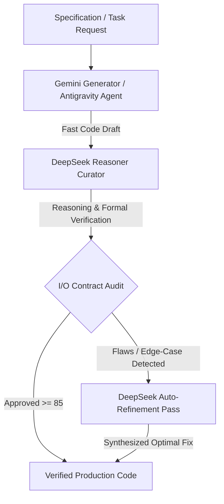

# ⚡ DSpark

> **Dual-LLM Speculative Arbitration Engine**  
> *High-Throughput Generation (Gemini) + Deep Reasoning I/O Arbitration (DeepSeek)*

[](https://opensource.org/licenses/MIT)
[](https://www.python.org/downloads/)
[](https://modelcontextprotocol.io/)
[](https://antigravity.google)

---

## 📖 Overview

**DSpark** is an AI-native agentic framework inspired by *Speculative Decoding* and *Generator-Critic* architectures.

In modern software development:
* **Generators (Google Gemini 3.7 / 2.5):** Excel at high generation speed, massive context windows (1M+ tokens), rapid codebase indexing, and multi-file editing.
* **Curators (DeepSeek Reasoner / V4 Pro):** Excel at deep algorithmic reasoning, formal contract verification, edge-case analysis, and mathematical correctness.

**DSpark pairs them together:** Gemini generates the fast, heavy code implementation, while DeepSeek acts as the strict **Chief Architect & Curator**, arbitrating input/output contracts, identifying hidden flaws, and verifying edge cases before code touches production.

---

## 🏛️ Architecture



---

## ✨ Features

- 🔍 **Rigorous I/O Contract Arbitration**: Validates function signatures, return types, empty states, boundary values, and resource safety.
- 🧠 **Deep Reasoning Edge-Case Audit**: Discovers race conditions, off-by-one errors, recursion overflows, and hidden complexity bottlenecks.
- ⚖️ **Multi-Candidate Arbitration**: Compares multiple AI-generated implementations and synthesizes the optimal, bug-free hybrid.
- 🛠️ **Google Antigravity (AGY) Native Skill**: Drop-in skill for Antigravity CLI and IDE agents.
- 🔌 **Model Context Protocol (MCP) Server**: Integrates seamlessly with Antigravity, Cursor, Claude Desktop, and Zed.
- 🚀 **Zero External Dependencies**: Lightweight core built using Python standard library.

---

## 🚀 Quick Start

### 1. Installation

```bash
git clone https://github.com/CostaJr007/dspark.git
cd dspark
pip install -e .
```

### 2. Configure Environment Variables

```bash
# Required for DeepSeek Curator
export DEEPSEEK_API_KEY="sk-your-deepseek-key"

# Optional: Set custom base URL or model
export DEEPSEEK_MODEL="deepseek-v4-pro"

# Optional: Required only if using standalone Gemini generator directly
export GEMINI_API_KEY="your-gemini-key"
```

---

## 💻 CLI Usage

### Audit Code Against Specification
```bash
dspark audit src/search.py --spec "Binary search with O(log N) complexity and empty list handling"
```

### Auto-Refine Code In-Place
```bash
dspark refine src/algorithm.py --spec "Optimize for O(1) auxiliary space" --in-place
```

### Arbitrate Between Alternative Implementations
```bash
dspark arbitrate candidate_a.py candidate_b.py --spec "Lock-free queue specification"
```

### End-to-End Dual Pipeline
```bash
dspark run "Create an LRU Cache with O(1) get and put operations" --lang python --out lru_cache.py
```

---

## 🤖 Using with Google Antigravity (AGY)

DSpark comes with built-in Skill and MCP support for Google Antigravity.

### Adding the Skill
Copy the skill into your project or global AGY skills directory:
```bash
# In your project directory:
mkdir -p .agents/skills
cp -r skill/dspark .agents/skills/
```

### Running with Antigravity
When chatting with Antigravity, you can instruct it:
> *"Use the dspark curator to review and arbitrate the algorithmic I/O contracts for the new auth middleware."*

Antigravity will automatically invoke DeepSeek to audit and refine the code!

---

## 🔌 Model Context Protocol (MCP) Server

To use DSpark as an MCP server with Cursor, Claude Desktop, or Antigravity:

Add to your `mcpServers` configuration:

```json
{
  "mcpServers": {
    "dspark": {
      "command": "python",
      "args": ["-m", "dspark.cli", "mcp"],
      "env": {
        "DEEPSEEK_API_KEY": "your-key-here"
      }
    }
  }
}
```

Exposed MCP Tools:
* `dspark_audit_code`: Deep reasoning audit and I/O validation.
* `dspark_refine_code`: Synthesize production-ready code with edge case fixes.
* `dspark_arbitrate`: Compare multiple candidate snippets and synthesize the winner.

---

## 🐍 Python SDK Example

```python
from dspark import DeepSeekCurator

curator = DeepSeekCurator()

code = """
def divide_chunks(l, n):
    for i in range(0, len(l), n):
        yield l[i:i + n]
"""

verdict = curator.audit(
    code=code,
    specification="Chunk a list into batches of size n. Handle n <= 0 and non-list inputs safely.",
    language="python"
)

print(f"Verdict: {verdict.verdict} (Score: {verdict.score}/100)")
for issue in verdict.critical_issues:
    print(f"Issue: {issue}")

if verdict.refined_code:
    print("Refined Code:\n", verdict.refined_code)
```

---

## 📄 License

MIT License - Created by [Adeilton Costa Jr](https://github.com/CostaJr007). Open for contributions!
