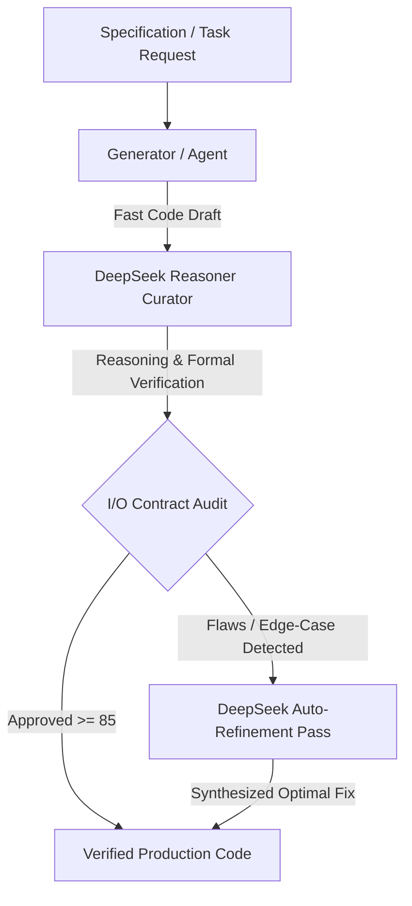

# DSpark CLI

Standalone dual-engine CLI (`dspark-cli`). This is **not** Grok Build and does not replace the `grok` app on your machine.

Creator and curator are separate models (default: Gemini-class draft + DeepSeek-class I/O curator). Config: `~/.dspark/config.toml`.

---

# DSpark

> **Dual-LLM Speculative Arbitration Engine** (Rust)
> *High-Throughput Generation (Gemini) + Deep Reasoning I/O Arbitration (DeepSeek)*

[](https://opensource.org/licenses/MIT)
[](https://www.rust-lang.org/)
[](https://modelcontextprotocol.io/)
[](https://antigravity.google)

---

## Overview

**DSpark** is an AI-native agentic framework inspired by *Speculative Decoding* and *Generator-Critic* architectures. The runtime, CLI, MCP server, pipeline, search engine, and curator are implemented in **Rust**. An optional Python SDK remains for notebooks and scripts.

In modern software development:

* **Generators (Google Gemini / GPT / local models):** Excel at high generation speed, massive context windows, rapid codebase indexing, and multi-file editing.
* **Curators (DeepSeek Reasoner / V4 Pro):** Excel at deep algorithmic reasoning, formal contract verification, edge-case analysis, and mathematical correctness.

**DSpark pairs them together:** a fast model drafts the implementation, while DeepSeek acts as the strict **Chief Architect & Curator**, arbitrating input/output contracts, identifying hidden flaws, and verifying edge cases before code touches production.

---

## Architecture



---

## Features

- **Rigorous I/O Contract Arbitration**: Validates function signatures, return types, empty states, boundary values, and resource safety.
- **Deep Reasoning Edge-Case Audit**: Discovers race conditions, off-by-one errors, recursion overflows, and hidden complexity bottlenecks.
- **Multi-Candidate Arbitration**: Compares multiple AI-generated implementations and synthesizes the optimal hybrid.
- **Interactive REPL**: Grok Build-style session with `/search`, `/audit`, `/refine`, `/local`, and natural-language tasks.
- **MCP Server**: Integrates with Cursor, Claude Desktop, Zed, and Antigravity.
- **Local LLMs**: Auto-detects Ollama, LM Studio, and vLLM.
- **Native Rust binary**: Fast startup, no Python runtime required for the CLI.

---

## Quick Start

### 1. Install the Rust CLI

```bash
git clone https://github.com/CostaJr007/dspark.git
cd dspark
cargo install --path .
```

This produces a standalone `dspark-cli` binary (does not change `grok` on your PATH).

```bash
dspark-cli pair
dspark-cli
```

### 2. Configure environment variables

```bash
# Required for DeepSeek Curator
export DEEPSEEK_API_KEY="sk-your-deepseek-key"

# Optional
export DEEPSEEK_MODEL="deepseek-v4-pro"
export GEMINI_API_KEY="your-gemini-key"
export OPENAI_API_KEY="your-openai-key"
```

On Windows PowerShell:

```powershell
$env:DEEPSEEK_API_KEY="sk-your-deepseek-key"
```

---

## CLI Usage

### Interactive terminal agent

```bash
dspark
# or
dspark interactive --generator gpt-4o-mini --curator deepseek-v4-flash --theme bloomberg
```

Slash commands inside the session:

* `/search <query>` — deep web research for docs, API specs, and error fixes
* `/fetch <url>` — scrape a page to clean Markdown
* `/files [path]` — inspect workspace files
* `/read <file>` — view a local file
* `/sh <command>` — run a shell command
* `/audit <file> -s <spec>` — audit I/O contracts with DeepSeek
* `/refine <file> -s <spec>` — synthesize a safer implementation in-place
* `/local` — scan Ollama / LM Studio
* `/models` — switch generator + curator pairing
* `/theme bloomberg|grok|matrix`

### Other commands

```bash
dspark search "FastAPI background tasks best practices"
dspark fetch https://docs.rs/tokio
dspark audit src/search.rs --spec "Binary search with O(log N) and empty-list handling"
dspark refine src/algorithm.rs --spec "Optimize for O(1) auxiliary space" --in-place
dspark arbitrate candidate_a.rs candidate_b.rs --spec "Lock-free queue specification"
dspark run "Implement a bounded LRU cache in Rust" --lang rust --out lru.rs
dspark local
dspark bench --generator gpt-4o-mini --curator deepseek-v4-flash --limit 5
dspark "Refactor auth.rs to use bcrypt and verify all edge cases"
```

---

## MCP Server

```json
{
  "mcpServers": {
    "dspark": {
      "command": "dspark",
      "args": ["mcp"],
      "env": {
        "DEEPSEEK_API_KEY": "your-key-here"
      }
    }
  }
}
```

Exposed tools:

* `dspark_audit_code` — deep reasoning audit and I/O validation
* `dspark_refine_code` — production-ready rewrite with edge-case fixes
* `dspark_arbitrate` — compare candidates and synthesize the winner

---

## Library (Rust)

```rust
use dspark::DeepSeekCurator;

#[tokio::main]
async fn main() -> Result<(), Box<dyn std::error::Error>> {
    let curator = DeepSeekCurator::new()?;
    let verdict = curator
        .audit(
            "fn divide_chunks(l: &[u8], n: usize) {}",
            "Chunk a list into batches of size n. Handle n == 0 safely.",
            Some("rust"),
        )
        .await?;
    println!("Verdict: {} (Score: {}/100)", verdict.verdict, verdict.score);
    Ok(())
}
```

Run the bundled examples (requires `DEEPSEEK_API_KEY`):

```bash
cargo run --example simple_audit
cargo run --example arbitrate_candidates
```

---

## Optional Python SDK

The `dspark/` package is an optional compatibility SDK (`pip install -e .`). The `dspark` console script is **not** installed from Python so it cannot shadow the Rust binary. Use `python -m dspark.cli` only if you explicitly want the legacy Python CLI.

```python
from dspark import DeepSeekCurator

curator = DeepSeekCurator()
verdict = curator.audit(
    code="def divide_chunks(l, n):\n    for i in range(0, len(l), n):\n        yield l[i:i + n]",
    specification="Chunk a list into batches of size n. Handle n <= 0 safely.",
    language="python",
)
print(f"Verdict: {verdict.verdict} (Score: {verdict.score}/100)")
```

---

## Google Antigravity (AGY)

```bash
mkdir -p .agents/skills
cp -r skill/dspark .agents/skills/
```

Then ask:

> *"Use the dspark curator to review and arbitrate the algorithmic I/O contracts for the new auth middleware."*

---

## License

MIT License — created by [Adeilson Costa](https://github.com/CostaJr007). Open for contributions.
