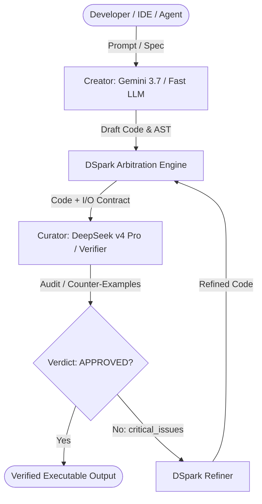

# DSpark: Unified Dual-Engine AI Coding Platform

[](https://www.rust-lang.org)
[](https://www.python.org)
[](https://modelcontextprotocol.io)
[](LICENSE)

**DSpark** is an enterprise-grade, unified dual-engine AI coding architecture. It bridges high-throughput creative generation (**Creator**) with rigorous, independent formal arbitration and verification (**Curator / LLM-as-a-Verifier**).

Single LLM systems that generate and review their own code suffer from **self-correction bias** (the *Self-Correction Fallacy*). DSpark eliminates this failure mode by assigning generation and verification to independent model families operating across formal Input/Output (I/O) contracts and CEGAR-style counter-example refinement.

---

## 🔬 Scientific & Empirical Foundation

### 1. The Self-Correction Fallacy (*Huang et al., 2023*)
Academic research has rigorously proven that **LLMs cannot reliably self-correct reasoning in the same autoregressive context** (*"Large Language Models Cannot Self-Correct Reasoning Yet"*, Huang et al., 2023; Stechly et al., 2024). 
* When a model generates code and is subsequently asked *"Are you sure this code is correct?"*, it suffers from **confirmation bias**. It rationalizes its own hallucinations and reaffirms flawed assumptions because both generation and review share the exact same attention context and token probability distribution.

### 2. Cross-Family Inductive Bias Diversity
DSpark breaks this echo chamber by pairing two completely distinct model families:
* **Creator (e.g., Google Gemini / Anthropic Claude):** Optimized for broad repository context, high throughput, and AST manipulation.
* **Curator (e.g., DeepSeek v4 Pro / DeepSeek v4 Flash / Any LLM):** Optimized for deep chain-of-thought mathematical reasoning and rigorous logical falsification.
* What lies in the pretraining and attention blind spots of Family A is easily caught by Family B.

### 3. CEGAR (Counterexample-Guided Abstraction Refinement) & I/O Contracts
Rather than asking for vague "code reviews", DSpark adapts formal verification methods:
* The Curator audits code against strict **Input/Output (I/O) contracts**, invariants, and boundary conditions.
* If a contract fails, the Curator synthesizes a deterministic **counter-example** (`counter_examples`) which serves as ground-truth feedback for the Refiner engine.

---

## 🌟 Tangible Developer Benefits

| Benefit | Single-Model Setup | DSpark Dual-Engine Setup |
|---|---|---|
| **Edge-Case Bug Detection** | ❌ Misses subtle boundary conditions and off-by-one errors | ✅ **Caught deterministically** via cross-family I/O arbitration |
| **Hallucination Loops** | ❌ Model repeatedly generates similar failing code | ✅ **Broken immediately** by concrete verifier counter-examples |
| **Token & Cost Efficiency** | ❌ Expensive reasoning models used for simple boilerplates | ✅ **Fast/cheap creator** + **targeted reasoning verifier** |
| **Verification Autonomy** | ❌ Requires manual user code review and test writing | ✅ **Automated via MCP background hooks** (No human fatigue) |
| **Vendor Portability** | ❌ Locked to a single AI vendor | ✅ **Universal**: Works across Google, Anthropic, DeepSeek, and Local LLMs |

---

## 🏛️ System Architecture



### Dual-Engine Roles

| Role | Primary Engine | Purpose | Operational Objective |
|---|---|---|---|
| **Creator** | **Gemini 3.7 Flash** | Drafts implementation, parses large repository contexts, handles AST modifications. | Maximize throughput and contextual breadth. |
| **Curator** | **DeepSeek v4 Pro** | Independent LLM-as-a-Verifier. Audits preconditions, postconditions, invariants, and edge cases. | Falsify errors, generate counter-examples, and enforce I/O contracts. |

---

## 📦 Unified Monorepo Structure

```text
dspark/
├── crates/
│   ├── dspark-core/          # Core dual-engine engine, CLI, REPL, and MCP Verifier Server
│   ├── codegen/              # Fullscreen Coding TUI crates (PTY, worktrees, chat-state, etc.)
│   │   ├── xai-grok-pager-bin/   # TUI application binary (dspark-cli)
│   │   ├── xai-codebase-graph/   # Tree-sitter code graph generator
│   │   ├── xai-fast-worktree/    # CoW git worktree virtualization
│   │   └── ...                   # Modular subsystem crates
│   └── common/               # Shared tracing, circuit-breaker, and tool-runtime crates
├── dspark/                   # Python SDK package (async pipelines, generators, curators)
├── skills/                   # Antigravity & Agentic skills (dspark-curate, hooks)
├── examples/                 # Rust & Python examples (arbitration, LeetCode, contracts)
├── tests/                    # Python and Rust test suites
├── pyproject.toml            # Python packaging specification
├── Cargo.toml                # Root Cargo Workspace definition
└── README.md                 # Technical platform documentation
```

---

## 🚀 Key Modules & Capabilities

### 1. Fullscreen Coding TUI (`dspark-cli`)
A complete, reactive fullscreen terminal UI designed for pairing with autonomous coding agents.
* **Continuous Background Curation**: Every file write triggers automated DeepSeek I/O contract audits.
* **Fast Worktrees**: Zero-overhead CoW git worktrees for isolated agent execution.
* **Tree-Sitter Graphs**: In-memory AST and dependency graphs for real-time repository navigation.

### 2. MCP Server (`dspark mcp`)
Native Model Context Protocol (MCP) server providing verification tools to external IDEs and agents (Antigravity, Cursor, Claude Code, Windsurf, Roo Code):
* `dspark_audit_code`: Formal audit of full source against prompt specifications and docstrings.
* `dspark_refine_code`: Automated patch generation based on counter-examples and critical issues.

### 3. Core Engine & CLI (`dspark-core`)
High-performance Rust CLI providing standalone utilities:
* `dspark audit <file> --spec <spec>`: Standalone code verification.
* `dspark pair`: Configure and test creator/curator model pairs.
* `dspark repl`: Interactive dual-engine coding environment.

### 4. Python SDK (`dspark`)
Full Python package providing programmatic access to the dual-engine pipeline:
```python
import asyncio
from dspark import DSparkPipeline

async def main():
    pipeline = DSparkPipeline(
        creator_model="gemini-2.5-flash",
        curator_model="deepseek-v4-pro"
    )
    result = await pipeline.run(
        prompt="Implement an LRU Cache in Python with O(1) ops.",
        spec="Must pass concurrency tests and boundary conditions."
    )
    print(result.verified_code)

if __name__ == "__main__":
    asyncio.run(main())
```

---

## 🛠️ Installation & Setup

### Prerequisites
* **Rust**: `rustc 1.80+` (Cargo workspace support)
* **Python**: `3.10+`

### Environment Variables
Configure your model provider keys:
```bash
export GEMINI_API_KEY="your-gemini-key"
export DEEPSEEK_API_KEY="your-deepseek-key"
export DSPARK_CURATOR="deepseek-v4-pro"
```

### Build from Source
```bash
# Clone repository
git clone https://github.com/CostaJr007/dspark.git
cd dspark

# Build Rust Core & TUI
cargo build --release

# Install Python SDK in editable mode
pip install -e .
```

---

## 🧪 Testing & Verification

```bash
# Run Rust Core tests
cargo test -p dspark-core

# Run Python SDK tests
python -m unittest discover tests

# Check workspace crates
cargo check -p dspark-core -p xai-grok-tools -p xai-grok-pager-bin
```

---

## 📄 License
Dual-licensed under MIT and Apache 2.0. See [LICENSE](LICENSE) for details.