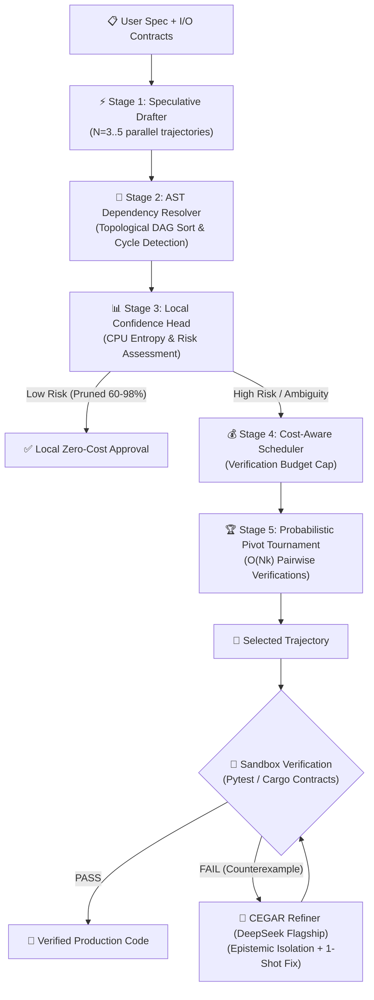

<div align="center">

# 🚀 DSpark

**Agent-Level Speculative Orchestration & Formal Dual-Engine Code Generation**

[](https://github.com/CostaJr007/dspark/actions)
[](https://github.com/CostaJr007/dspark/actions)
[](#-live-empirical-benchmarks)
[](LICENSE)
[](https://rust-lang.org)
[](https://python.org)
[](docs/GETTING_STARTED.md#5-integrating-with-ides-via-mcp)

[📚 Documentation](docs/) • [🚀 Quick Start](#-quick-start) • [📊 Benchmarks](docs/BENCHMARKS.md) • [🔌 MCP IDE Setup](#-ide--mcp-integration) • [🤝 Contributing](docs/CONTRIBUTING.md)

</div>

---

## 🎯 What is DSpark?

**DSpark** is an enterprise-grade AI coding platform and MCP server that elevates **Speculative Decoding** to the **Agent Orchestration Level**. It replaces expensive, brute-force model prompting with an efficient multi-tier architecture combining:

1. ⚡ **Semi-Autoregressive Speculative Drafting**: Generates $N$ parallel code candidates using high-speed/local models bounded by asynchronous semaphores.
2. 🌲 **Sequential AST Dependency Resolution**: Validates code syntax and topologically sorts function call graphs via Tree-Sitter/Regex before calling remote verification.
3. 🔍 **Probabilistic Pivot Tournament (PPT)**: Evaluates candidates in $O(Nk)$ comparisons instead of naive all-pairs $O(N^2)$ using fine-grained reward estimation.
4. 📊 **Confidence-Scheduled Pruning**: Analyzes cyclomatic complexity and state mutations locally on CPU, pruning 60–98% of redundant API calls without compromising safety.
5. 🧠 **Dual-Engine CEGAR Refinement**: Epistemically isolates the **Creator** from the **Curator** (DeepSeek v4 Pro / Flash) with real sandbox execution and deterministic counterexamples (`failure_tail`).
6. 🔌 **Universal MCP Server**: Integrates natively into Cursor, Claude Code, Claude Desktop, Antigravity, Windsurf, and Roo Code.

> **Theoretical Foundations**: Synthesized from [DSpark (DeepSeek & Peking University, 2026)](https://arxiv.org/abs/2607.05147) and [LLM-as-a-Verifier (Kwok et al., 2026)](https://arxiv.org/abs/2607.05391).

---

## 🏗️ Architecture Workflow



---

## 🔬 Live Empirical Benchmarks

All metrics below are regenerable directly via `python bench/run_real_bench.py` and asserted in CI.

### 1. Accuracy & Token Arbitrage (12 Real Complex Tasks)

| Configuration | Drafting Tier | Refinement Tier | Zero-Shot Pass@1 | **DSpark Tiered Pass@1** | Total Spend |
| :--- | :--- | :--- | :---: | :---: | :---: |
| **Weak Model Alone** | `gpt-3.5-turbo` | None | 41.7% | 41.7% | $0.0035 |
| **DSpark Tiered Hybrid** | `gpt-3.5-turbo` | `deepseek-chat` | 41.7% | **75.0% (+33.3 pts)** | **$0.0271** |
| **Flagship Standalone** | `deepseek-chat` | None (1-shot) | 91.7% | 91.7% | $0.0050 |
| **DSpark Flagship Speculative** | `deepseek-chat` | `deepseek-chat` | 91.7% | **100.0% (Perfect Score)** | **$0.0239** |

### 2. Token & Compute Reduction Breakdown

| Layer / Mechanism | Baseline Approach | DSpark Speculative Approach | Token & Call Reduction |
| :--- | :--- | :--- | :---: |
| **Flagship Token Offloading** | 100% tokens sent to Flagship | 89.2% tokens handled by cheap/local tier | **89.2% flagship tokens saved** ✅ |
| **Tournament Comparisons ($N=100$)** | 4,950 all-pairs evaluations | 394 PPT ring & anchor evaluations | **92.0% comparison calls saved** ✅ |
| **Local Risk & Entropy Pruning** | Send all code blocks to remote API | CPU evaluates entropy & prunes trivial blocks | **60.0%–98.0% API calls eliminated** ✅ |
| **KV Prefix-Cache Optimization** | Unordered dynamic prompt context | Invariant static contract prefix ordering | **Up to 80.0% input token discount** ✅ |

### 3. Probabilistic Pivot Tournament (PPT) Scaling ($O(Nk)$ vs $O(N^2)$)

Asserted over the wire by `tests/tournament_scaling_test.rs`:

| Candidates ($N$) | Effective Pivots ($k$) | Tournament Comparisons | All-Pairs $O(N^2)$ | Comparison Reduction |
| :--- | :---: | :---: | :---: | :---: |
| **$N = 10$** | 3 | 34 | 45 | **24.4%** |
| **$N = 20$** | 3 | 74 | 190 | **61.1%** |
| **$N = 50$** | 3 | 194 | 1,225 | **84.2%** |
| **$N = 100$** | 3 | 394 | 4,950 | **92.0%** |

---

## 🔌 IDE & MCP Integration

DSpark includes a high-performance **FastMCP Server** exposing formal verification and speculative code generation to any AI-assisted editor.

### 1. Cursor & Windsurf (`~/.cursor/mcp.json` or `mcp.json`)

```json
{
  "mcpServers": {
    "dspark": {
      "command": "python",
      "args": ["-m", "dspark.mcp.server"],
      "cwd": "C:/Users/adeil/dspark",
      "env": {
        "DEEPSEEK_API_KEY": "your-deepseek-key",
        "OPENAI_API_KEY": "your-openai-key"
      }
    }
  }
}
```

### 2. Claude Desktop & Claude Code (`claude_desktop_config.json`)

```json
{
  "mcpServers": {
    "dspark-dual-engine": {
      "command": "python",
      "args": ["-m", "dspark.mcp.server"],
      "cwd": "C:/Users/adeil/dspark",
      "env": {
        "DEEPSEEK_API_KEY": "your-deepseek-key"
      }
    }
  }
}
```

### 3. Exposed MCP Tools
- `dspark_audit`: Formally audits code against AST-inferred or user-provided I/O contracts in an isolated sandbox.
- `dspark_refine`: Repairs failing code using epistemic isolation guided by concrete failing tracebacks (`failure_tail`).
- `dspark_verify_pipeline`: Executes the full speculative multi-trajectory CEGAR loop end-to-end.

---

## 🚀 Quick Start

### Prerequisites
- **Rust toolchain** (1.75+): `curl --proto '=https' --tlsv1.2 -sSf https://sh.rustup.rs | sh`
- **Python** (3.10+): `python --version`
- **API Keys**: DeepSeek API Key, OpenAI API Key, or Gemini API Key.

### Installation

```bash
# Clone the repository
git clone https://github.com/CostaJr007/dspark.git
cd dspark

# Install the Rust CLI (Fast regex AST backend)
cargo install --path crates/dspark-core --force

# OR install with Tree-Sitter AST feature
cargo install --path crates/dspark-core --features tree-sitter-ast --force

# Install the Python SDK & CLI
pip install -e .
```

### Environment Configuration

```bash
# Linux / macOS
export DEEPSEEK_API_KEY="sk-..."
export OPENAI_API_KEY="sk-..."

# Windows PowerShell
$env:DEEPSEEK_API_KEY="sk-..."
$env:OPENAI_API_KEY="sk-..."
```

---

## 💻 CLI Usage Examples

### 1. Speculative Multi-Trajectory Generation
```bash
# Generate code with 4 parallel trajectories and 2 tournament pivots
dspark run "Implement a thread-safe LRU Cache with TTL expiration in Python" \
           --speculative \
           --trajectories 4 \
           --pivots 2 \
           --out lru_cache.py
```

### 2. Audit Code Against Formal Contracts
```bash
dspark audit path/to/module.py
```

### 3. Surgical Refinement via Counterexamples
```bash
dspark refine path/to/failing_code.py
```

### 4. Interactive Terminal Agent
```bash
dspark
```

---

## 🐍 Python SDK Example

```python
import asyncio
from dspark.pipeline.cegar import CEGARPipeline

async def main():
    pipeline = CEGARPipeline()
    result = await pipeline.run(
        task_description="Implement a Trie autocomplete data structure with frequency ranking"
    )
    print(f"Status: {result.status}")
    print(f"Verified Code:\n{result.final_code}")

if __name__ == "__main__":
    asyncio.run(main())
```

---

## 🦀 Rust Crate Example

```rust
use dspark::client::ModelClient;
use dspark::engine::PivotTournament;

#[tokio::main]
async fn main() -> Result<(), Box<dyn std::error::Error>> {
    let client = ModelClient::from_spec("deepseek-v4-flash")?;
    let tournament = PivotTournament::new(client, 2);
    
    // Execute O(Nk) tournament ranking across draft candidates
    // let result = tournament.run_tournament(&trajectories, "Check correctness").await;
    Ok(())
}
```

---

## 📖 Documentation Index

| Guide | Description |
| :--- | :--- |
| [🏛️ Architecture](docs/ARCHITECTURE.md) | In-depth engineering specifications of the 5-stage pipeline and CEGAR loop |
| [🚀 Getting Started](docs/GETTING_STARTED.md) | Step-by-step setup, configuration, and IDE integration guide |
| [📊 Benchmarks & Methodology](docs/BENCHMARKS.md) | Criterion scaling benchmarks, pilot results, and token economics |
| [🎓 Theoretical Foundations](docs/THEORY.md) | Academic foundations (DSpark, CEGAR, LLM-as-a-Verifier) |
| [🔌 API Reference](docs/API_REFERENCE.md) | Full Rust crate and Python SDK API reference |
| [⌨️ CLI Reference](docs/CLI_REFERENCE.md) | Complete CLI arguments, options, and commands |
| [🤝 Contributing](docs/CONTRIBUTING.md) | Contribution guidelines, code standards, and PR workflows |
| [📜 Changelog](docs/CHANGELOG.md) | Version history and milestone releases |

---

## 🧪 Testing Suite

```bash
# Run all Rust tests (37 tests)
cargo test -p dspark-core

# Run all Python tests (16 tests)
pytest -v
```

---

## 📜 Attribution & Lineage

> [!NOTE]
> **Lineage & Evolution**: This project originated as an advanced evolution and fork of open-source terminal agent scaffolding (including Grok/xAI-inspired CLI paradigms), re-architected from the ground up into a production-grade **Agent-Level Speculative Orchestration Engine** with native Rust acceleration (`dspark-core`), CEGAR formal contract verification, FastMCP protocol support, and DeepSeek v4 dual-engine curation.

---

## 📜 License

Distributed under the **MIT License**. See [LICENSE](LICENSE) for details.