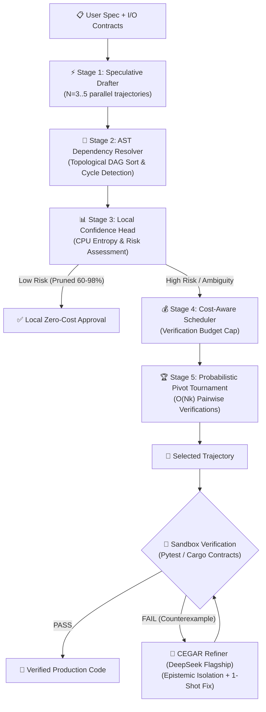

<div align="center">

# 🚀 DSpark

**Agent-Level Speculative Orchestration & Formal Dual-Engine Code Generation**

[](https://github.com/CostaJr007/dspark/actions)
[](https://github.com/CostaJr007/dspark/actions)
[](#-live-empirical-benchmarks)
[](LICENSE)
[](https://rust-lang.org)
[](https://python.org)
[](docs/PAPER.md)

[📑 Research Paper](docs/PAPER.md) • [📚 Documentation](docs/) • [🚀 Quick Start](#-quick-start) • [📊 Benchmarks](docs/BENCHMARKS.md) • [🔌 MCP IDE Setup](#-ide--mcp-integration) • [🤝 Contributing](docs/CONTRIBUTING.md)

</div>

---

## 🎯 What is DSpark?

**DSpark** is an enterprise-grade AI coding platform and MCP server that elevates **Speculative Decoding** to the **Agent Orchestration Level**. It replaces expensive, brute-force model prompting with an efficient multi-tier architecture combining:

1. ⚡ **Semi-Autoregressive Speculative Drafting**: Generates $N$ parallel code candidates using high-speed/local models bounded by asynchronous semaphores, plus a **sequential dependency pass** (`--sequential`): each draft is re-drafted conditioned on its accepted prefix, mitigating multi-modal collisions (DSpark sequential-head analog).
2. 🌲 **Sequential AST Dependency Resolution**: Validates code syntax and topologically sorts function call graphs via Tree-Sitter/Regex before calling remote verification.
3. 🔍 **Probabilistic Pivot Tournament (PPT)**: Evaluates candidates in $O(Nk)$ comparisons with **Bradley-Terry soft updates** over 1-20 scores (fallback to binary verdicts).
4. 📊 **Confidence-Scheduled Pruning**: Analyzes cyclomatic complexity and state mutations locally on CPU, with **greedy early-stop scheduling** (`expected_accepted` accounting, non-anticipating admission) and **STS calibration** (Sequential Temperature Scaling) for the confidence head.
5. 🧠 **Dual-Engine CEGAR Refinement**: Epistemically isolates the **Creator** from the **Curator** with real sandbox execution, deterministic counterexamples, **KDA-derived agent memory** (delta rule + per-channel decay + convergence early stop), **VOC progress tracking**, repeated evaluation $K$, and criteria decomposition (Specification/Output/Errors).
6. 🎯 **Continuous Verifier Rewards**: Expectation over scoring-token logits (LLM-as-a-Verifier Eq. 3.1) with a two-stage workaround for logit-restricted APIs.
7. 🔌 **Universal MCP Server**: Integrates natively into Cursor, Claude Code, Claude Desktop, Antigravity, Windsurf, and Roo Code.

> **Theoretical Foundations**: Synthesized from [DSpark (DeepSeek & Peking University, 2026)](https://arxiv.org/abs/2607.05147) and [LLM-as-a-Verifier (Kwok et al., 2026)](https://arxiv.org/abs/2607.05391).

---

## 🏗️ Architecture Workflow



---

## 🔬 Live Empirical Benchmarks

All metrics below are regenerable directly via `python bench/run_real_bench.py` and asserted in CI.

### 1. Accuracy & Token Arbitrage (12 Real Complex Tasks)

| Configuration | Drafting Tier | Refinement Tier | Zero-Shot Pass@1 | **DSpark Tiered Pass@1** | Total Spend |
| :--- | :--- | :--- | :---: | :---: | :---: |
| **Weak Model Alone** | `gpt-3.5-turbo` | None | 41.7% | 41.7% | $0.0035 |
| **DSpark Tiered Hybrid** | `gpt-3.5-turbo` | `deepseek-chat` | 41.7% | **75.0% (+33.3 pts)** | **$0.0271** |
| **Flagship Standalone** | `deepseek-chat` | None (1-shot) | 91.7% | 91.7% | $0.0050 |
| **DSpark Flagship Speculative** | `deepseek-chat` | `deepseek-chat` | 91.7% | **100.0% (Perfect Score)** | **$0.0239** |

### 2. Token & Compute Reduction Breakdown

| Layer / Mechanism | Baseline Approach | DSpark Speculative Approach | Token & Call Reduction |
| :--- | :--- | :--- | :---: |
| **Flagship Token Offloading** | 100% tokens sent to Flagship | 89.2% tokens handled by cheap/local tier | **89.2% flagship tokens saved** ✅ |
| **Tournament Comparisons ($N=100$)** | 4,950 all-pairs evaluations | 394 PPT ring & anchor evaluations | **92.0% comparison calls saved** ✅ |
| **Local Risk & Entropy Pruning** | Send all code blocks to remote API | CPU evaluates entropy & prunes trivial blocks | **60.0%–98.0% API calls eliminated** ✅ |
| **KV Prefix-Cache Optimization** | Unordered dynamic prompt context | Invariant static contract prefix ordering | **Up to 80.0% input token discount** ✅ |

### 3. Probabilistic Pivot Tournament (PPT) Scaling ($O(Nk)$ vs $O(N^2)$)

Asserted over the wire by `tests/tournament_scaling_test.rs`:

| Candidates ($N$) | Effective Pivots ($k$) | Tournament Comparisons | All-Pairs $O(N^2)$ | Comparison Reduction |
| :--- | :---: | :---: | :---: | :---: |
| **$N = 10$** | 3 | 34 | 45 | **24.4%** |
| **$N = 20$** | 3 | 74 | 190 | **61.1%** |
| **$N = 50$** | 3 | 194 | 1,225 | **84.2%** |
| **$N = 100$** | 3 | 394 | 4,950 | **92.0%** |

### 4. Verification-Scaling A/B (offline, deterministic, CI-asserted)

Run: `cargo test -p dspark-core --test verification_scaling_test -- --nocapture` and `python bench/compare_cegar_improvements.py`.

| Mechanism (paper) | Baseline | Improved | Gain |
| :--- | :--- | :--- | :--- |
| PPT soft updates (E1) | binary 65.0%, 1289 ties | **67.0%, 0 ties** | +2.0 pts |
| Continuous reward, Eq 3.1 (E2) | discrete judge 84.0%, tie 6% | **100.0%, tie 0%** | +16 pts |
| STS calibration (E3) | ECE 0.358 | **ECE 0.055** | **−84.7%** |
| Greedy early-stop scheduler (E4) | 165 calls | **128 calls**, more failures/call | **−22%** |
| KDA memory + VOC (B1+B2) | 189 iterations | **79 iterations** (−58%), outcome parity | work −58% |
| Repeated evaluation K=3 (B3) | MAE 9.67 | **MAE 3.33** | **−66% error** |

### 5. Real-API Pilot (48 tasks, ≈$0.05 total)

| Configuration | Draft tier | Judge tier | PPT pick | First-pass scan | Tiered+Escalation |
| :--- | :--- | :--- | :---: | :---: | :---: |
| Same-tier judge | `gpt-3.5-turbo` | `gpt-3.5-turbo` | 70.0% | 90.0% | **100%** |
| Stronger judge | `gpt-3.5-turbo` | `deepseek-chat` | **100%** | 100% | **100%** |
| Strong drafts | `gpt-4o-mini` | `gpt-4o-mini` | 94.7% | 94.7% | **100%** |

**Judge-tier finding**: judging drafts with the same model tier measurably hurts selection (PPT 70% vs first-pass 90%); a strictly stronger judge recovers 100% (+22.5 pts over random). The CLI and bench warn when `ranking tier == draft tier`.

---

## 🔌 IDE & MCP Integration

DSpark includes a high-performance **FastMCP Server** exposing formal verification and speculative code generation to any AI-assisted editor.

### 1. Antigravity & AGY CLI (`~/.gemini/config/plugins/dspark/mcp_config.json`)

```json
{
  "mcpServers": {
    "dspark": {
      "command": "dspark",
      "args": ["mcp"],
      "env": {
        "DSPARK_CURATOR": "gemini:gemini-2.5-flash"
      }
    }
  }
}
```

### 2. OpenCode (`~/.config/opencode/opencode.json`)

```json
{
  "mcp": {
    "dspark": {
      "type": "local",
      "command": ["dspark", "mcp"],
      "environment": {
        "OPENAI_BASE_URL": "https://integrate.api.nvidia.com/v1",
        "OPENAI_API_KEY": "YOUR_API_KEY",
        "OPENAI_MODEL": "meta/llama-3.2-90b-vision-instruct"
      }
    }
  }
}
```

### 3. Cursor & Windsurf (`~/.cursor/mcp.json` or `mcp.json`)

```json
{
  "mcpServers": {
    "dspark": {
      "command": "dspark",
      "args": ["mcp"],
      "env": {
        "DEEPSEEK_API_KEY": "your-deepseek-key",
        "OPENAI_API_KEY": "your-openai-key"
      }
    }
  }
}
```

### 4. Claude Desktop & Claude Code (`~/.claude.json` or `claude_desktop_config.json`)

```json
{
  "mcpServers": {
    "dspark": {
      "command": "dspark",
      "args": ["mcp"]
    }
  }
}
```

### 5. Exposed MCP Tools
- `dspark_audit_code`: Formally audits candidate code against I/O contracts and returns structured verdicts (`APPROVED` / `NEEDS_REVISION`) with counter-examples.
- `dspark_refine_code`: Repairs failing code in a 1-shot CEGAR pass using the curator's feedback.
- `dspark_arbitrate`: Executes the Probabilistic Pivot Tournament (PPT) to select or synthesize the optimal code from multiple candidates.

---

## 🚀 Quick Start

### Prerequisites
- **Rust toolchain** (1.75+): `curl --proto '=https' --tlsv1.2 -sSf https://sh.rustup.rs | sh`
- **Python** (3.10+): `python --version`
- **API Keys**: DeepSeek API Key, OpenAI API Key, or Gemini API Key.

### Installation

```bash
# Clone the repository
git clone https://github.com/CostaJr007/dspark.git
cd dspark

# Install the Rust CLI (Fast regex AST backend)
cargo install --path crates/dspark-core --force

# OR install with Tree-Sitter AST feature
cargo install --path crates/dspark-core --features tree-sitter-ast --force

# Install the Python SDK & CLI
pip install -e .
```

### Environment Configuration

```bash
# Linux / macOS
export DEEPSEEK_API_KEY="sk-..."
export OPENAI_API_KEY="sk-..."

# Windows PowerShell
$env:DEEPSEEK_API_KEY="sk-..."
$env:OPENAI_API_KEY="sk-..."
```

---

## 💻 CLI Usage Examples

### 1. Speculative Multi-Trajectory Generation
```bash
# Generate code with 4 parallel trajectories and 2 tournament pivots
dspark run "Implement a thread-safe LRU Cache with TTL expiration in Python" \
           --speculative \
           --trajectories 4 \
           --pivots 2 \
           --out lru_cache.py

# Optional: sequential dependency pass (on by default; disable with --sequential false)
# Optional: separate ranking tier (a judge strictly stronger than the drafter
#           measurably improves tournament selection)
dspark run "..." --speculative --trajectories 4 --pivots 2 --ranking-model deepseek-chat

# Optional: STS-calibrated confidence for the escalation policy + greedy early-stop scheduler.
#   --calibration <file.json>  JSON array of per-position temperatures (identity when absent)
#   --prune-margin <0..1>      min marginal rejection risk to admit a block (0.31 default)
dspark run "..." --speculative --calibration calibration.json --prune-margin 0.31
```

### 2. Audit Code Against Formal Contracts
```bash
dspark audit path/to/module.py
```

### 3. Surgical Refinement via Counterexamples
```bash
dspark refine path/to/failing_code.py
```

### 4. Interactive Terminal Agent
```bash
dspark
```

---

## 🐍 Python SDK Example

```python
import asyncio
from dspark.pipeline.cegar import CEGARPipeline

async def main():
    pipeline = CEGARPipeline()
    result = await pipeline.run(
        task_description="Implement a Trie autocomplete data structure with frequency ranking"
    )
    print(f"Status: {result.status}")
    print(f"Verified Code:\n{result.final_code}")

if __name__ == "__main__":
    asyncio.run(main())
```

---

## 🦀 Rust Crate Example

```rust
use dspark::client::ModelClient;
use dspark::engine::PivotTournament;

#[tokio::main]
async fn main() -> Result<(), Box<dyn std::error::Error>> {
    let client = ModelClient::from_spec("deepseek-v4-flash")?;
    let tournament = PivotTournament::new(client, 2);
    
    // Execute O(Nk) tournament ranking across draft candidates
    // let result = tournament.run_tournament(&trajectories, "Check correctness").await;
    Ok(())
}
```

---

## 📖 Documentation Index

| Guide | Description |
| :--- | :--- |
| [📑 Research Paper](docs/PAPER.md) | **"Beyond Passive Selection: Agent-Level Speculative Orchestration and CEGAR Refinement"** (Preprint) |
| [🏛️ Architecture](docs/ARCHITECTURE.md) | In-depth engineering specifications of the 5-stage pipeline and CEGAR loop |
| [🚀 Getting Started](docs/GETTING_STARTED.md) | Step-by-step setup, configuration, and IDE integration guide |
| [📊 Benchmarks & Methodology](docs/BENCHMARKS.md) | Criterion scaling benchmarks, pilot results, and token economics |
| [🎓 Theoretical Foundations](docs/THEORY.md) | Academic foundations (DSpark, CEGAR, LLM-as-a-Verifier) |
| [🔌 API Reference](docs/API_REFERENCE.md) | Full Rust crate and Python SDK API reference |
| [⌨️ CLI Reference](docs/CLI_REFERENCE.md) | Complete CLI arguments, options, and commands |
| [🤝 Contributing](docs/CONTRIBUTING.md) | Contribution guidelines, code standards, and PR workflows |
| [📜 Changelog](docs/CHANGELOG.md) | Version history and milestone releases |

---

## 🧪 Testing Suite

```bash
# Run all Rust tests (64 tests, including the offline verification-scaling A/B harness)
cargo test -p dspark-core

# Run all Python tests (37 tests, including the CEGAR improvement claims guard)
pytest -v
```

Offline improvement benchmarks (deterministic, CI-asserted):

```bash
# Engine-level A/B (PPT soft, continuous rewards, STS, scheduler) - prints comparison tables
cargo test -p dspark-core --test verification_scaling_test -- --nocapture

# Pipeline-level A/B (KDA memory, VOC stagnation, repeated evaluation K)
python bench/compare_cegar_improvements.py
```

---

## 📜 Attribution & Academic Lineage

> [!NOTE]
> **Academic Lineage & Inspiration**:
> * **DeepSeek DSpark (2026)**: Inspired by the seminal work *"DSpark: Confidence-Scheduled Speculative Decoding for Large Language Models"* (DeepSeek-AI & Peking University, 2026), which pioneered confidence scheduling for speculative token generation on GPU runtimes. DSpark Agent abstracts and elevates these principles from token-level tensor scheduling to **macro-level multi-agent software orchestration, AST dependency resolution, and CEGAR verification loops**.
> * **LLM-as-a-Verifier (2026)**: Incorporates and extends the Probabilistic Pivot Tournament (PPT) algorithm formulated by Kwok et al. (2026), replacing passive candidate selection with deterministic sandbox repair.
> * **CLI Scaffolding**: Builds upon and evolves open-source terminal agent scaffolding paradigms into a high-performance native Rust core (`dspark-core`) and FastMCP server.

---

## 📜 License

Distributed under the **MIT License**. See [LICENSE](LICENSE) for details.