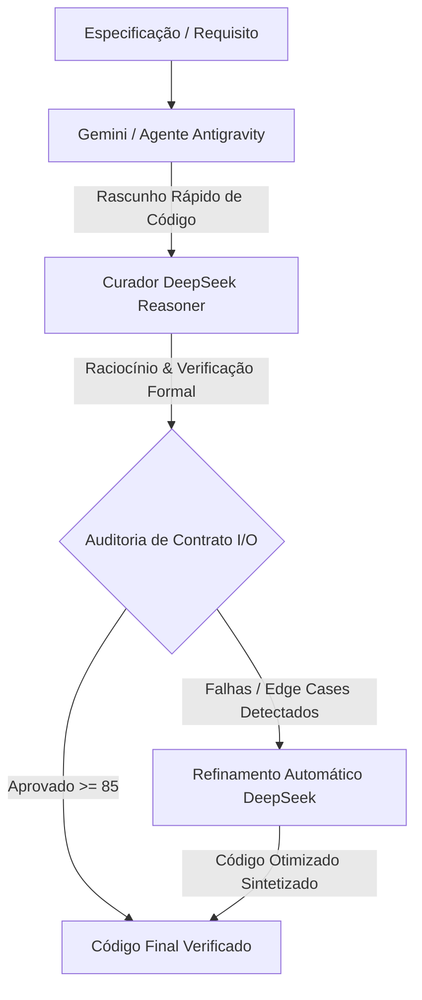

# ⚡ DSpark

> **Motor de Arbitragem Especulativa Dual-LLM**  
> *Geração de Alto Desempenho (Gemini) + Curadoria e Raciocínio de I/O Profundo (DeepSeek)*

[](https://opensource.org/licenses/MIT)
[](https://www.python.org/downloads/)
[](https://modelcontextprotocol.io/)
[](https://antigravity.google)

---

## 📖 Visão Geral

O **DSpark** é um framework de IA agentic inspirado em *Speculative Decoding* e no padrão *Generator-Critic*.

No desenvolvimento de software com IA:
* **Geradores (Google Gemini 3.7 / 2.5):** Destacam-se pela velocidade ultra-rápida, contexto massivo (1 milhão+ de tokens), indexação veloz de repositórios e edição de múltiplos arquivos.
* **Curadores (DeepSeek Reasoner / V4 Pro):** Destacam-se pelo raciocínio lógico profundo, verificação formal de contratos, auditoria de casos limites (*edge cases*) e rigor matemático.

O **DSpark une o melhor dos dois mundos:** O Gemini gera o rascunho e a estrutura pesada do código, enquanto o DeepSeek atua como o **Arquiteto-Chefe / Curador**, validando entradas/saídas (I/O), detectando falhas sutis e garantindo código 100% pronto para produção.

---

## 🏛️ Arquitetura



---

## ✨ Recursos

- 🔍 **Arbitragem Rigorosa de I/O**: Validação de tipos, assinaturas, estados nulos, listas vazias e limites de valores.
- 🧠 **Auditoria de Casos Limites (*Edge Cases*)**: Identificação de *race conditions*, *off-by-one*, limites de recursão e vazamentos de memória.
- ⚖️ **Arbitragem de Candidatos**: Compara múltiplas implementações e sintetiza a melhor solução sem bugs.
- 🛠️ **Skill Nativa para Google Antigravity (AGY)**: Use diretamente no Antigravity CLI e Antigravity IDE.
- 🔌 **Servidor MCP (Model Context Protocol)**: Funciona no Antigravity, Cursor, Claude Desktop e VS Code.
- 🚀 **Zero Dependências Externas**: Núcleo leve construído sobre a biblioteca padrão do Python.

---

## 🚀 Como Instalar e Usar

```bash
git clone https://github.com/CostaJr007/dspark.git
cd dspark
pip install -e .
```

### Variáveis de Ambiente

```bash
export DEEPSEEK_API_KEY="sua-chave-deepseek"
```

---

## 💻 Exemplos de Uso do CLI

### Modo Interativo (Estilo Grok-Build + Kimi Code)
Abra a sessão interativa diretamente no seu terminal:
```bash
dspark
```

Dentro da sessão interativa, use os *slash commands*:
* `/search <busca>` - Pesquisa profunda na web por documentações e correções de erros (estilo Kimi).
* `/fetch <url>` - Raspa página web e converte para Markdown limpo.
* `/files [pasta]` - Lista arquivos e estrutura do projeto.
* `/read <arquivo>` - Lê e exibe código local.
* `/sh <comando>` - Executa comando de terminal (`pytest`, `npm test`, etc.).
* `/audit <arquivo> -s <spec>` - Audita contratos e invariantes com DeepSeek.
* `/refine <arquivo> -s <spec>` - Refina o código no próprio arquivo.

### Pesquisa Web Direta
```bash
dspark search "FastAPI background tasks best practices"
```

### Auditoria e Refinamento
```bash
# Auditar código com DeepSeek
dspark audit src/busca.py --spec "Busca binária O(log N) tratando listas vazias"

# Refinar código diretamente no arquivo
dspark refine src/algoritmo.py --spec "Otimizar para O(1) de memória auxiliar" --in-place

# Arbitrar entre dois códigos candidatos
dspark arbitrate candidato_a.py candidato_b.py --spec "Fila concorrente sem lock"
```

### Execução de Tarefa One-Shot
```bash
dspark "Refatore o arquivo auth.py para usar bcrypt e valide todos os edge cases"
```

---

## 🤖 Integração com Google Antigravity (AGY)

Adicione a pasta `skill/dspark` em `.agents/skills/` no seu projeto.
No chat do Antigravity, basta pedir:
> *"Use o curador dspark para auditar o contrato de I/O e casos limites desse novo serviço."*

---

## 📄 Licença

MIT License - Criado por [Adeilson Costa](https://github.com/CostaJr007).
