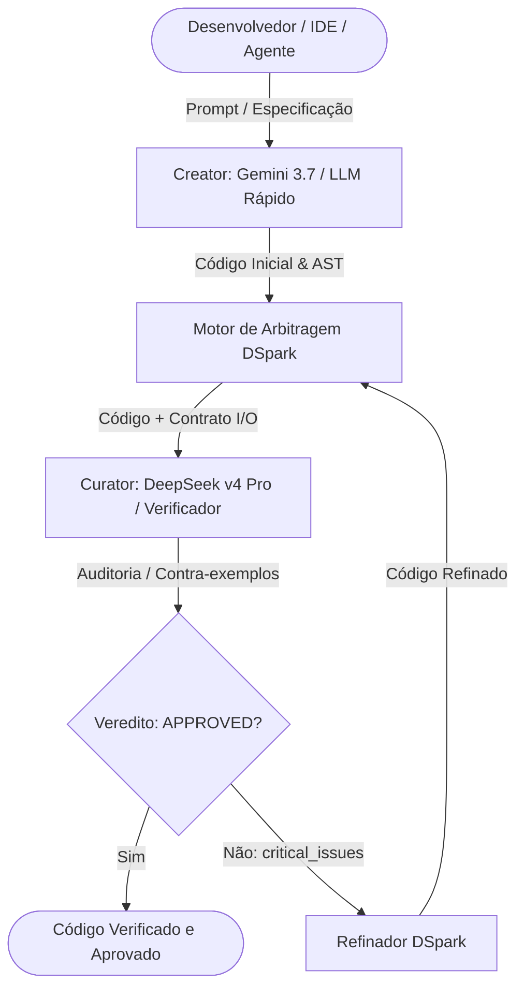

# DSpark: Plataforma Unificada de Código com Dual-Engine

[](https://www.rust-lang.org)
[](https://www.python.org)
[](https://modelcontextprotocol.io)
[](LICENSE)

O **DSpark** é uma arquitetura unificada de IA para geração e verificação de código. Ele integra a alta taxa de transferência e geração criativa (**Creator**) com a arbitragem e verificação rigorosa e independente de contratos de I/O (**Curator / LLM-as-a-Verifier**).

Sistemas baseados em um único LLM que geram e revisam o próprio código sofrem do **viés de auto-correção** (*Self-Correction Fallacy*). O DSpark elimina esse problema separando as tarefas entre famílias distintas de modelos com refinamento guiado por contra-exemplos (estilo CEGAR).

---

## Arquitetura do Sistema



### Papéis do Dual-Engine

| Papel | Motor Principal | Finalidade | Objetivo |
|---|---|---|---|
| **Creator** | **Gemini 3.7 Flash** | Escreve implementações, lê contextos amplos de repositórios e edita arquivos. | Maximizar vazão, contexto e velocidade. |
| **Curator** | **DeepSeek v4 Pro** | LLM-as-a-Verifier independente. Audita pré-condições, pós-condições e casos de borda. | Falsear erros, sintetizar contra-exemplos e validar contratos de I/O. |

---

## Estrutura do Monorepo Unificado

```text
dspark/
├── crates/
│   ├── dspark-core/          # Núcleo Rust, CLI, REPL e Servidor MCP Verifier
│   ├── codegen/              # Crates da TUI em tela cheia (PTY, worktrees, chat-state, etc.)
│   │   ├── xai-grok-pager-bin/   # Binário executável da TUI (dspark-cli)
│   │   ├── xai-codebase-graph/   # Gerador de grafo de código via tree-sitter
│   │   ├── xai-fast-worktree/    # Virtualização de worktrees Git com CoW
│   │   └── ...                   # Crates modulares do ecossistema
│   └── common/               # Crates compartilhados (tracing, circuit breaker, tool-runtime)
├── dspark/                   # Pacote Python SDK (pipelines assíncronos, geradores, curadores)
├── skills/                   # Skills do Antigravity e hooks (dspark-curate, automações)
├── examples/                 # Exemplos em Rust e Python (arbitragem, LeetCode, contratos)
├── tests/                    # Suítes de testes em Rust e Python
├── pyproject.toml            # Configuração do pacote Python
├── Cargo.toml                # Definição do Workspace raiz Cargo
└── README.md                 # Documentação técnica do projeto
```

---

## Componentes Principais

1. **TUI Fullscreen (`dspark-cli`):** Interface de terminal completa com curadoria automática contínua em segundo plano.
2. **Servidor MCP (`dspark mcp`):** Expõe ferramentas padronizadas (`dspark_audit_code`, `dspark_refine_code`) para Antigravity, Cursor, Claude Code, Windsurf e Roo Code.
3. **CLI & Engine Core (`dspark-core`):** Executável autônomo para auditoria rápida, REPL interativo e arbitragem.
4. **Python SDK (`dspark`):** Biblioteca Python para integração direta em pipelines e fluxos de dados.

---

## Testes e Validação

```bash
# Testes do núcleo Rust
cargo test -p dspark-core

# Testes do pacote Python
python -m unittest discover tests

# Validação dos crates do workspace
cargo check -p dspark-core -p xai-grok-tools -p xai-grok-pager-bin
```