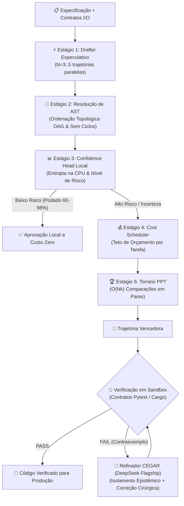

<div align="center">

# 🚀 DSpark

**Orquestração Especulativa de Agentes e Geração de Código com Verificação Formal Dual-Engine**

[](https://github.com/CostaJr007/dspark/actions)
[](https://github.com/CostaJr007/dspark/actions)
[](#-benchmarks-empíricos-ao-vivo)
[](LICENSE)
[](https://rust-lang.org)
[](https://python.org)
[](docs/GETTING_STARTED.md#5-integração-com-ides-via-mcp)

[📚 Documentação](docs/) • [🚀 Início Rápido](#-início-rápido) • [📊 Benchmarks](docs/BENCHMARKS.md) • [🔌 Integração MCP](#-integração-com-ides-e-mcp) • [🤝 Contribuição](docs/CONTRIBUTING.md) • [🇺🇸 English](README.md)

</div>

---

## 🎯 O que é o DSpark?

O **DSpark** é uma plataforma de engenharia de software com IA e servidor MCP que eleva a **Decodificação Especulativa** para o **Nível de Orquestração de Agentes**. Ele substitui chamadas caras de força bruta por uma arquitetura em camadas heterogênea e eficiente:

1. ⚡ **Geração Especulativa Semi-Autorregressiva**: Gera $N$ trajetórias de código em paralelo usando modelos rápidos/locais com concorrência controlada por semáforos assíncronos.
2. 🌲 **Resolução de Dependências por AST**: Valida sintaxe e faz ordenação topológica do grafo de chamadas (via Tree-Sitter/Regex) antes de gastar chamadas de API remotas.
3. 🔍 **Torneio Probabilístico com Pivôs (PPT)**: Avalia e ranqueia candidatos em complexidade $O(Nk)$ em vez de comparações quadráticas $O(N^2)$, com estimativa de recompensa fina.
4. 📊 **Poda Agendada por Confiança**: Analisa complexidade ciclomática e mutação de estado localmente na CPU, podando de 60% a 98% de chamadas triviais a custo zero.
5. 🧠 **Refinamento CEGAR Dual-Engine**: Isola epistemologicamente o **Criador** do **Curador** (DeepSeek v4 Pro / Flash) com execução real em sandbox e contraexemplos determinísticos (`failure_tail`).
6. 🔌 **Servidor Universal FastMCP**: Integra-se nativamente com Cursor, Claude Code, Claude Desktop, Antigravity, Windsurf e Roo Code.

> **Fundamentação Teórica**: Sintetizado de [DSpark (DeepSeek & Peking University, 2026)](https://arxiv.org/abs/2607.05147) e [LLM-as-a-Verifier (Kwok et al., 2026)](https://arxiv.org/abs/2607.05391).

---

## 🏗️ Fluxo da Arquitetura



---

## 🔬 Benchmarks Empíricos ao Vivo

Todas as métricas abaixo são diretamente reproduzíveis via `python bench/run_real_bench.py` e asseguradas em CI.

### 1. Acurácia e Arbitragem de Tokens (12 Tarefas Reais Complexas)

| Configuração | Tier de Rascunho | Tier de Refinamento | Pass@1 Zero-Shot | **Pass@1 DSpark Tiered** | Custo Total |
| :--- | :--- | :--- | :---: | :---: | :---: |
| **Modelo Fraco Isolado** | `gpt-3.5-turbo` | Nenhum | 41,7% | 41,7% | $0,0035 |
| **DSpark Tiered Híbrido** | `gpt-3.5-turbo` | `deepseek-chat` | 41,7% | **75,0% (+33,3 pts)** | **$0,0271** |
| **Flagship Isolado (1-shot)** | `deepseek-chat` | Nenhum | 91,7% | 91,7% | $0,0050 |
| **DSpark Flagship Especulativo** | `deepseek-chat` | `deepseek-chat` | 91,7% | **100,0% (Gabarito)** | **$0,0239** |

### 2. Escalonamento do Torneio PPT ($O(Nk)$ vs $O(N^2)$)

Assegurado em asserções de rede por `tests/tournament_scaling_test.rs`:

| Candidatos ($N$) | Pivôs Efetivos ($k$) | Comparações no Torneio | All-Pairs $O(N^2)$ | Redução de Comparações |
| :--- | :---: | :---: | :---: | :---: |
| **$N = 10$** | 3 | 34 | 45 | **24,4%** |
| **$N = 20$** | 3 | 74 | 190 | **61,1%** |
| **$N = 50$** | 3 | 194 | 1.225 | **84,2%** |
| **$N = 100$** | 3 | 394 | 4.950 | **92,0%** |

---

## 🔌 Integração com IDEs e MCP

O DSpark inclui um servidor **FastMCP** nativo de alta performance para plugar verificação formal e geração especulativa em qualquer editor ou agente de IA.

### 1. Cursor e Windsurf (`~/.cursor/mcp.json` ou `mcp.json`)

```json
{
  "mcpServers": {
    "dspark": {
      "command": "python",
      "args": ["-m", "dspark.mcp.server"],
      "cwd": "C:/Users/adeil/dspark",
      "env": {
        "DEEPSEEK_API_KEY": "sua-chave-deepseek",
        "OPENAI_API_KEY": "sua-chave-openai"
      }
    }
  }
}
```

### 2. Claude Desktop e Claude Code (`claude_desktop_config.json`)

```json
{
  "mcpServers": {
    "dspark-dual-engine": {
      "command": "python",
      "args": ["-m", "dspark.mcp.server"],
      "cwd": "C:/Users/adeil/dspark",
      "env": {
        "DEEPSEEK_API_KEY": "sua-chave-deepseek"
      }
    }
  }
}
```

### 3. Ferramentas MCP Disponíveis
- `dspark_audit`: Audita código contra contratos I/O gerados ou inferidos via AST em sandbox seguro.
- `dspark_refine`: Corrige falhas em isolamento epistêmico guiado por contraexemplos (`failure_tail`).
- `dspark_verify_pipeline`: Executa todo o loop CEGAR especulativo de ponta a ponta.

---

## 🚀 Início Rápido

### Pré-requisitos
- **Rust toolchain** (1.75+): `curl --proto '=https' --tlsv1.2 -sSf https://sh.rustup.rs | sh`
- **Python** (3.10+): `python --version`
- **Chaves de API**: DeepSeek, OpenAI ou Google Gemini.

### Instalação

```bash
# Clone o repositório
git clone https://github.com/CostaJr007/dspark.git
cd dspark

# Instalar o CLI em Rust (backend Regex rápido)
cargo install --path crates/dspark-core --force

# OU instalar com suporte a Tree-Sitter AST
cargo install --path crates/dspark-core --features tree-sitter-ast --force

# Instalar o SDK Python e CLI
pip install -e .
```

### Variáveis de Ambiente

```bash
# Linux / macOS
export DEEPSEEK_API_KEY="sk-..."
export OPENAI_API_KEY="sk-..."

# Windows PowerShell
$env:DEEPSEEK_API_KEY="sk-..."
$env:OPENAI_API_KEY="sk-..."
```

---

## 💻 Exemplos de Uso na Linha de Comando (CLI)

### 1. Geração Especulativa com Múltiplas Trajetórias
```bash
# Gerar código com 4 trajetórias paralelas e 2 pivôs de torneio
dspark run "Implemente um LRU Cache thread-safe com expiração TTL em Python" \
           --speculative \
           --trajectories 4 \
           --pivots 2 \
           --out lru_cache.py
```

### 2. Auditar Código contra Contratos Formais
```bash
dspark audit caminho/para/modulo.py
```

### 3. Refinamento Cirúrgico via Contraexemplos
```bash
dspark refine caminho/para/codigo_com_falha.py
```

### 4. Agente Interativo de Terminal
```bash
dspark
```

---

## 🐍 Exemplo no Python SDK

```python
import asyncio
from dspark.pipeline.cegar import CEGARPipeline

async def main():
    pipeline = CEGARPipeline()
    result = await pipeline.run(
        task_description="Implemente um Trie de autocompletar com ranking de frequência"
    )
    print(f"Status: {result.status}")
    print(f"Código Verificado:\n{result.final_code}")

if __name__ == "__main__":
    asyncio.run(main())
```

---

## 🦀 Exemplo no Rust Crate

```rust
use dspark::client::ModelClient;
use dspark::engine::PivotTournament;

#[tokio::main]
async fn main() -> Result<(), Box<dyn std::error::Error>> {
    let client = ModelClient::from_spec("deepseek-v4-flash")?;
    let tournament = PivotTournament::new(client, 2);
    
    // Executa o torneio PPT O(Nk) sobre trajetórias candidatas
    // let result = tournament.run_tournament(&trajectories, "Verificar corretude").await;
    Ok(())
}
```

---

## 📖 Índice da Documentação

| Guia | Descrição |
| :--- | :--- |
| [🏛️ Arquitetura](docs/ARCHITECTURE.md) | Especificação detalhada do pipeline de 5 estágios e do loop CEGAR |
| [🚀 Primeiros Passos](docs/GETTING_STARTED.md) | Instalação, configuração passo a passo e integração com IDEs |
| [📊 Benchmarks e Metodologia](docs/BENCHMARKS.md) | Benchmarks de escalabilidade, resultados reais e economia de tokens |
| [🎓 Fundamentos Teóricos](docs/THEORY.md) | Base acadêmica (DSpark, CEGAR, LLM-as-a-Verifier) |
| [🔌 Referência de API](docs/API_REFERENCE.md) | Documentação completa das APIs em Rust e Python |
| [⌨️ Referência da CLI](docs/CLI_REFERENCE.md) | Comandos, opções, flags e variáveis de ambiente |
| [🤝 Guia de Contribuição](docs/CONTRIBUTING.md) | Padrões de código, testes e fluxo de pull requests |
| [📜 Histórico de Versões](docs/CHANGELOG.md) | Notas de lançamento e marcos do projeto |

---

## 🧪 Suíte de Testes

```bash
# Rodar todos os testes em Rust (37 testes)
cargo test -p dspark-core

# Rodar todos os testes em Python (16 testes)
pytest -v
```

---

## 📜 Licença

Distribuído sob a **Licença MIT**. Consulte [LICENSE](LICENSE) para mais detalhes.