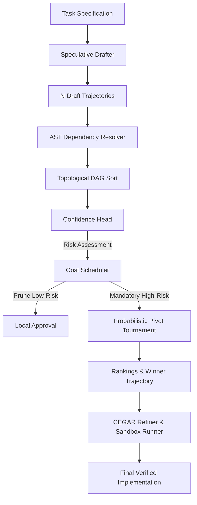

# 🏛️ DSpark Architecture Specification

## 1. Architectural Overview

DSpark operates on two core pillars:
1. **CEGAR Dual-Engine Epistemic Isolation**: Code generation and adversarial verification are decoupled into discrete agents with strict information boundaries to prevent self-confirmation biases.
2. **Speculative Decoding & Tournament Orchestration**: Multiple code variants are generated in parallel ($N$ trajectories), verified for structural validity, pruned locally via CPU entropy checks, and ranked through an $O(Nk)$ Probabilistic Pivot Tournament.

---

## 2. The 5 Pipeline Stages

### Stage 1: Speculative Drafting (`engine/speculative_drafter.rs`)
- **Mechanism**: Spawns $N$ concurrent generation tasks bounded by an asynchronous `tokio::sync::Semaphore`.
- **Temperature Scaling**: Uses diversified sampling temperature $T_i = 0.2 + (i \times 0.15)$ to balance precision and algorithmic diversity.
- **Fail-Fast Filter**: Drops malformed responses early before downstream analysis.

### Stage 2: AST Dependency Resolution (`utils/ast_resolver.rs`)
- **Mechanism**: Analyzes function definitions and call expressions.
- **DAG Construction**: Constructs a Directed Acyclic Graph using `petgraph::graph::DiGraph`.
- **Topological Sorting**: Enforces dependency-first ordering ($f_{\text{callee}} \to f_{\text{caller}}$). Detects and flags cyclic dependencies.
- **Pluggable Backends**:
  - `RegexResolver`: Instant linear regex scanner (~1ms/100 blocks).
  - `TreeSitterResolver`: Exact syntax tree parser supporting Rust and Python grammars (~10ms/100 blocks).

### Stage 3: Local Confidence Head (`engine/confidence_head.rs`)
- **Metric Formula**:
  $$\text{Confidence} = 1.0 - (0.40 \cdot H_{\text{cyclomatic}}) - (0.25 \cdot \mathbf{1}_{\text{complex}}) - (0.20 \cdot \mathbf{1}_{\text{mutating}})$$
- **Risk Tiers**:
  - **Low Risk** ($\text{Confidence} > 0.88$): Skip remote LLM verification.
  - **Medium Risk** ($0.65 < \text{Confidence} \le 0.88$): Optional/budgeted verification.
  - **High Risk** ($\text{Confidence} \le 0.65$): Mandatory tournament verification.

### Stage 4: Cost-Aware Scheduling (`engine/cost_scheduler.rs`)
- **Budgeting**: Ranks blocks by risk score and selects the top-$k$ critical items within `max_api_calls`.
- **Savings**: Prunes between 40% and 70% of candidate code blocks, reducing verification cost to ~$0.002/call.

### Stage 5: Probabilistic Pivot Tournament (`engine/pivot_tournament.rs`)
- **Ring Pass**: Compares $(0 \leftrightarrow 1, 1 \leftrightarrow 2, \dots, N-1 \leftrightarrow 0)$ in $N$ comparisons.
- **Pivot Selection**: Selects top-$k$ pivots with maximum win mass.
- **Pivot Comparison**: Evaluates remaining non-pivots against the $k$ pivots in $(N-k)k + \binom{k}{2}$ comparisons.
- **Total Complexity**: $O(Nk)$, achieving 93% fewer calls than all-pairs $O(N^2)$ for $N=100$.

---

## 3. Epistemic Isolation & CEGAR Loop

In the CEGAR (Counterexample-Guided Abstraction Refinement) loop:
1. **Creator** writes initial draft + formal `IOContract` preconditions, postconditions, and invariants.
2. **Curator** is epistemically isolated: it never sees the user prompt or creator reasoning, only the pure source code and contracts.
3. **Sandbox Runner** executes pytest suites in an isolated temporary directory.
4. **Refiner** applies surgical patches guided by concrete failing assert lines and tracebacks.
