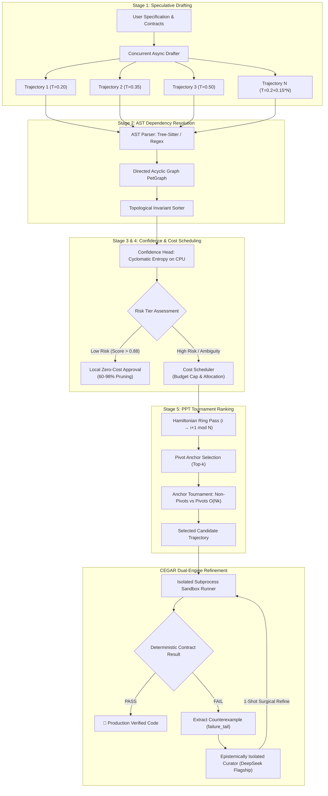
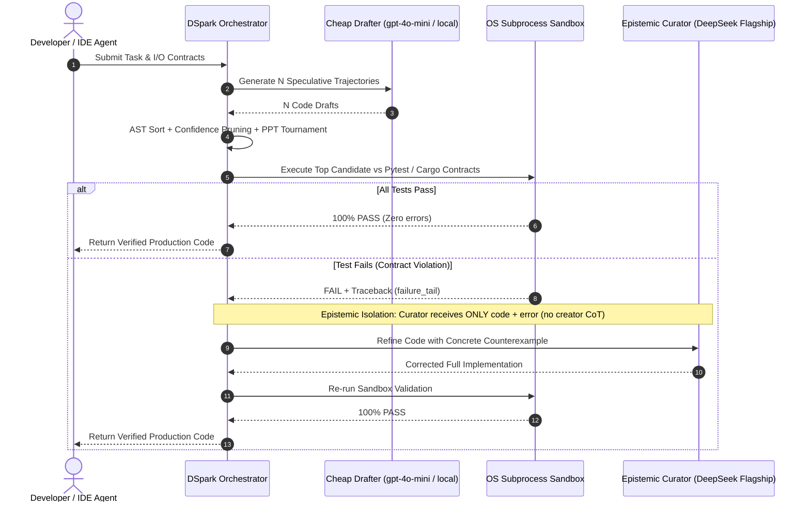
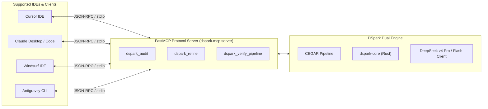

# 🏛️ DSpark Architecture Specification

## 1. Architectural Overview

DSpark is structured around two foundational principles:
1. **CEGAR Dual-Engine Epistemic Isolation**: Code generation and adversarial verification are decoupled into discrete agents with strict information boundaries to prevent self-confirmation biases.
2. **Speculative Orchestration & Tournament Selection**: Multiple code variants are generated in parallel ($N$ trajectories), topologically sorted by syntax dependency graphs, pruned locally via CPU entropy checks, and ranked through an $O(Nk)$ Probabilistic Pivot Tournament before executing surgical CEGAR repairs on failures.

---

## 2. The 5 Pipeline Stages

### Stage 1: Speculative Drafting (`crates/dspark-core/src/engine/speculative_drafter.rs`)
- **Mechanism**: Spawns $N$ concurrent generation tasks bounded by an asynchronous `tokio::sync::Semaphore`.
- **Temperature Scaling**: Uses diversified sampling temperature $T_i = 0.2 + (i \times 0.15)$ to balance precision and algorithmic exploration across the solution space.
- **Fail-Fast Filter**: Drops malformed or truncated responses early before downstream analysis.

### Stage 2: AST Dependency Resolution (`crates/dspark-core/src/utils/ast_resolver.rs`)
- **Mechanism**: Analyzes function definitions, imports, and call expressions.
- **DAG Construction**: Constructs a Directed Acyclic Graph using `petgraph::graph::DiGraph`.
- **Topological Sorting**: Enforces dependency-first ordering ($f_{\text{callee}} \to f_{\text{caller}}$). Detects and flags cyclic dependencies.
- **Pluggable Backends**:
  - `RegexResolver`: Instant linear regex scanner (~1ms/100 blocks).
  - `TreeSitterResolver`: Exact syntax tree parser supporting Rust and Python grammars (~10ms/100 blocks).

### Stage 3: Local Confidence Head (`crates/dspark-core/src/engine/confidence_head.rs`)
- **Metric Formula**:
  $$\text{Confidence} = 1.0 - (0.40 \cdot H_{\text{cyclomatic}}) - (0.25 \cdot \mathbf{1}_{\text{complex}}) - (0.20 \cdot \mathbf{1}_{\text{mutating}})$$
- **Risk Tiers**:
  - **Low Risk** ($\text{Confidence} > 0.88$): Skip remote LLM verification.
  - **Medium Risk** ($0.65 < \text{Confidence} \le 0.88$): Optional/budgeted verification.
  - **High Risk** ($\text{Confidence} \le 0.65$): Mandatory tournament verification.

### Stage 4: Cost-Aware Scheduling (`crates/dspark-core/src/engine/cost_scheduler.rs`)
- **Budgeting**: Ranks blocks by risk score and selects the top-$k$ critical items within `max_api_calls`.
- **Savings**: Prunes between 60% and 98% of candidate code blocks, enforcing a hard spend ceiling per task.

### Stage 5: Probabilistic Pivot Tournament (`crates/dspark-core/src/engine/pivot_tournament.rs`)
The implemented algorithm performs exactly:
$$\text{Comparisons}(N, k) = N + (N-k)k + \binom{k}{2} = O(Nk)$$

1. **Hamiltonian Ring Pass**: Evaluates candidates $(i \to i+1 \pmod N)$.
2. **Pivot Selection**: Extracts the $k$ highest-scoring trajectories as anchors.
3. **Anchor Tournament**: Evaluates non-anchor candidates strictly against the $k$ pivots.

---

## 3. CEGAR Loop & Epistemic Isolation

---

## 4. MCP (Model Context Protocol) Architecture

DSpark exposes its core engine to external IDEs via a standardized FastMCP server:

