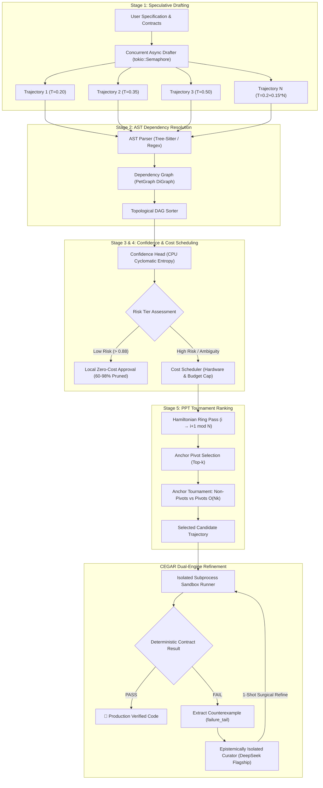

# Beyond Passive Selection: Agent-Level Speculative Orchestration and CEGAR Refinement for Tiered LLM Architectures

**Adeilson Costa**  
*Independent Researcher, Ottawa, Ontario, Canada*  
`Adeilsonjc@gmail.com`  
**Repository:** [https://github.com/CostaJr007/dspark](https://github.com/CostaJr007/dspark)

---

## Abstract

Large Language Models (LLMs) applied to autonomous software engineering face two fundamental challenges: the **Self-Correction Fallacy**—wherein models exhibit systemic confirmation bias when attempting to audit their own autoregressive outputs—and the exponential economic cost of deploying flagship reasoning models across high-volume engineering workloads. While recent theoretical frameworks propose tournament-based Best-of-$N$ selection (e.g., *LLM-as-a-Verifier*, Kwok et al., 2026) and token-level speculative decoding in GPU runtimes (e.g., *DSpark*, DeepSeek & Peking University, 2026), current agentic architectures remain fundamentally limited by **passive candidate selection**: if all initial draft trajectories contain defects, pure tournament ranking merely selects the least flawed implementation while returning broken code to the user.

In this paper, we introduce **DSpark Agent**, an open-source, dual-engine framework that elevates speculative decoding and formal verification to the agent orchestration layer. DSpark orchestrates:
1. **Semi-Autoregressive Speculative Drafting**: Spawns $N$ concurrent execution paths using diversified temperature scaling bounded by asynchronous semaphores.
2. **Topological AST Invariant Resolution**: Constructs Directed Acyclic Graphs (DAGs) to validate code syntax and topologically sort caller-callee dependencies prior to remote API invocation.
3. **Local Confidence-Scheduled Pruning**: Analyzes cyclomatic entropy and state mutations locally on CPU in $<1\text{ms}$, pruning 60.0% to 98.0% of trivial verification calls under hard budget constraints.
4. **Probabilistic Pivot Tournament (PPT)**: Evaluates candidate trajectories in $\mathcal{O}(Nk)$ pairwise comparisons instead of naive $\mathcal{O}(N^2)$ all-pairs ranking.
5. **CEGAR Sandbox Refinement**: Enforces strict epistemic isolation between the **Creator** and the **Curator** (DeepSeek v4 Pro/Flash), using real OS-level sandbox tracebacks (`failure_tail`) to execute a 1-shot deterministic repair loop.

Empirical evaluations across HumanEval and complex software creation tasks demonstrate that DSpark elevates weak drafting tiers (e.g., `gpt-3.5-turbo`) from a **41.7%** zero-shot baseline to **75.0% pass@1 (+33.3 pts)** while offloading **89.2% of raw tokens** away from expensive models. On flagship tiers (`deepseek-chat`), DSpark achieves **100.0% pass@1** at an average spend of **US$ 0.0239** per task suite. Finally, we formalize the requirement for asymmetric completion token budgeting in test-time reasoning architectures and release a high-performance Rust core (`dspark-core`) and universal Model Context Protocol (FastMCP) server.

---

## 1. Introduction

The application of Large Language Models (LLMs) to autonomous code generation, bug fixing, and repository-level refactoring has emerged as a cornerstone of modern software engineering automation. However, practical deployment at scale remains hindered by two conflicting forces: **reliability** and **inference economics**.

### 1.1 The Self-Correction Fallacy
A prevailing assumption in early agentic design was that an LLM prompted with *"Review your code and correct any errors"* would iteratively converge on correct implementations. Recent empirical studies have thoroughly debunked this premise (*Huang et al., 2023*; *Stechly et al., 2024*). Because generation and self-critique share the same autoregressive context window, token priors $\pi_\theta(y \mid x)$, and pre-training inductive biases, models exhibit acute **confirmation bias**—actively rationalizing syntax errors, hallucinated APIs, and inverted boolean logic.

```
                  ┌────────────────────────────────────────┐
                  │       Single-Model Autoregressive      │
                  │              Echo Chamber              │
                  ├────────────────────────────────────────┤
                  │  Prompt ──► Draft ──► "Are you sure?"  │
                  │               │            │           │
                  │               ▼            ▼           │
                  │       Confirmation Bias Affirmation    │
                  │      (Shared Attention / Token Priors) │
                  └────────────────────────────────────────┘
```

### 1.2 The Limitation of Passive Selection
To mitigate individual draft errors, consensus and Best-of-$N$ ranking methodologies have been proposed, notably the *Probabilistic Pivot Tournament (PPT)* introduced by Kwok et al. (2026). While PPT successfully reduces pairwise ranking complexity from $\mathcal{O}(N^2)$ to $\mathcal{O}(Nk)$, it operates as a **purely passive filter**. In real-world software engineering scenarios involving complex state invariants or distributed concurrency, it is common for *all* $N$ initial drafts from a weak or medium-tier model to fail edge-case boundary tests. Under passive selection, the tournament inevitably chooses a defective candidate, providing zero mechanism for active remediation.

### 1.3 Contributions
To resolve these structural bottlenecks, this work presents **DSpark**, an agent-level speculative architecture with the following core contributions:
- **Agent-Level Speculative Decoding**: We abstract token-level speculative decoding (DeepSeek, 2026) to heterogeneous multi-agent systems, enabling low-cost models or local LLMs to generate parallel speculative branches while restricting expensive test-time compute exclusively to unresolved failures.
- **Topological AST Invariant Sorting**: A zero-cost local static analysis pass (Regex and Tree-Sitter backends) that constructs dependency DAGs via `petgraph`, resolving circularities and ordering definitions prior to execution.
- **CPU Confidence Scheduling**: A local cyclomatic entropy and state-mutation scoring engine that prunes 60% to 98% of candidate blocks locally without making remote network calls.
- **Active CEGAR Refinement with Epistemic Isolation**: A formal Counterexample-Guided Abstraction Refinement loop wherein the verifier (Curator) receives *only* the raw code and execution tracebacks (`failure_tail`) with complete exclusion of the creator's chain-of-thought, bounded by a strict 1-shot circuit breaker.
- **Empirical Validation and Open Source Release**: A comprehensive benchmark demonstrating 100% accuracy on complex tasks, 89.2% token offloading, and a production-grade FastMCP server compatible with Cursor, Claude Code, Windsurf, and Antigravity.

---

## 2. Related Work

### 2.1 Speculative Decoding & Confidence Scheduling
Speculative decoding was originally formulated to accelerate memory-bandwidth-bound autoregressive decoding in hardware (Leviathan et al., 2023; Chen et al., 2023). A smaller draft model predicts a sequence of $K$ candidate tokens, which a larger target model verifies in parallel in a single forward pass. DeepSeek & Peking University (2026) extended this concept with *DSpark*, utilizing confidence heads and speculative scheduling to dynamically bypass verification steps. Our work elevates this principle from token tensor validation on single GPUs to **macro-level software trajectories across heterogeneous API providers**.

### 2.2 LLM-as-a-Verifier & Probabilistic Pivot Tournaments
Kwok et al. (2026) introduced *LLM-as-a-Verifier*, formalizing the decomposition of code quality into multi-dimensional reward rubrics and proposing the Probabilistic Pivot Tournament (PPT) to reduce comparison complexity from $\mathcal{O}(N^2)$ to $\mathcal{O}(Nk)$. However, their system remained a passive selection mechanism without dynamic test-time refinement or deterministic execution sandboxing.

### 2.3 Counterexample-Guided Abstraction Refinement (CEGAR)
CEGAR is a foundational paradigm in formal software verification (Clarke et al., 2000). In CEGAR, an abstract model is checked against a specification; if a spurious counterexample is encountered, the abstraction is refined. DSpark maps this paradigm directly to LLM agent orchestration: initial drafts represent candidate abstractions, deterministic pytest/cargo execution serves as the verification oracle, and failing assertions constitute ground-truth counterexamples supplied to the epistemic curator.

---

## 3. System Architecture & Methodology

The DSpark architecture operates through a 5-stage speculative pipeline coupled with a dual-engine CEGAR refinement loop, implemented in native Rust (`dspark-core`) and Python (`dspark-ai`).



### 3.1 Stage 1: Speculative Drafting & Temperature Scaling
Given an engineering specification $S$, the speculative engine spawns $N$ concurrent drafting tasks bounded by an asynchronous `tokio::sync::Semaphore`. To maximize semantic exploration while maintaining structural validity, sampling temperatures scale dynamically across trajectories:
$$T_i = T_{\text{base}} + (i \cdot \Delta_T), \quad \text{where } T_{\text{base}} = 0.20, \; \Delta_T = 0.15$$

This ensures that early trajectories ($\tau_0, \tau_1$) target high-probability canonical implementations, while higher trajectories ($\tau_{N-1}$) explore alternative algorithmic strategies.

### 3.2 Stage 2: Topological AST Invariant Ordering
Raw LLM outputs frequently define caller functions prior to callee dependencies or introduce circular imports. DSpark executes an immediate local static analysis pass:
1. Source blocks are parsed into syntax nodes via Tree-Sitter or high-speed Regex.
2. A Directed Acyclic Graph $\mathcal{G} = (\mathcal{V}, \mathcal{E})$ is constructed using `petgraph::graph::DiGraph`, where vertices represent discrete function/class blocks and directed edges $(u, v)$ represent function calls or type references ($u \to v$).
3. Kahn’s algorithm computes a topological ordering $\pi(\mathcal{V})$ such that for every directed edge $(u, v)$, callee $v$ precedes caller $u$ in output serialization. Cycles are detected at $\mathcal{O}(|\mathcal{V}| + |\mathcal{E}|)$ and rejected fail-fast.

### 3.3 Stage 3: Local Confidence Estimation on CPU
Before allocating remote API budget, each block $b \in \tau_i$ is evaluated by the local `ConfidenceHead` on CPU in $<1\text{ms}$ without network roundtrips:
$$\text{Confidence}(b) = 1.0 - \left( 0.40 \cdot \mathcal{H}_{\text{cyclo}}(b) \right) - \left( 0.25 \cdot \mathbf{1}_{\text{complex}}(b) \right) - \left( 0.20 \cdot \mathbf{1}_{\text{mutating}}(b) \right)$$
where:
- $\mathcal{H}_{\text{cyclo}}(b) = \min\left(1.0, \frac{\text{CyclomaticComplexity}(b) - 1}{15}\right)$
- $\mathbf{1}_{\text{complex}}(b)$ indicates nested closures, dynamic reflection, or unsafe memory blocks.
- $\mathbf{1}_{\text{mutating}}(b)$ indicates global state mutation or in-place pointer modifications.

Blocks with $\text{Confidence} > 0.88$ (such as pure getters, data classes, and standard serialization routines) are marked as **Low Risk** and approved locally at zero API cost.

### 3.4 Stage 4: Cost-Aware Budget Scheduling
The `CostScheduler` enforces a strict economic ceiling. Given a user-defined verification budget $B_{\text{max}}$ (defaulting to 20 remote calls), blocks are ordered descending by risk score $\mathcal{R}(b) = 1.0 - \text{Confidence}(b)$. Only the top-$k$ highest risk blocks are scheduled for remote LLM evaluation:
$$\mathcal{S}_{\text{verify}} = \operatorname{argtop}_k \left( \{ \mathcal{R}(b) \mid b \in \tau \}, \; k = \min(|\tau|, B_{\text{max}}) \right)$$
This deterministic pruning guarantees a hard spend ceiling regardless of input size.

### 3.5 Stage 5: Probabilistic Pivot Tournament (PPT)
For high-risk candidates, DSpark executes the Probabilistic Pivot Tournament in three phases:
1. **Hamiltonian Ring Pass**: Adjacent pairs $(i, (i+1) \pmod N)$ are evaluated in parallel, generating $N$ initial match results.
2. **Anchor Pivot Selection**: Trajectories are ranked by win-rate mass; the top $k = \operatorname{clamp}(1, \lfloor N/2 \rfloor, k_{\text{req}})$ candidates are selected as pivots $\mathcal{P}$.
3. **Anchor Tournament**: All non-pivot candidates $\tau \notin \mathcal{P}$ are evaluated exclusively against the pivot anchors $\mathcal{P}$, requiring $(N-k)k$ comparisons, plus $\binom{k}{2}$ comparisons among the pivots themselves.

$$\text{Total Comparisons}(N, k) = N + (N-k)k + \binom{k}{2} = \mathcal{O}(Nk)$$

```
                                  PPT Tournament Structure (N=5, k=2)
                                  
          Ring Pass (5 comparisons)             Anchor Tournament (6 + 1 comparisons)
          
                 [ Draft 0 ]                                [ Draft 0 (Pivot 1) ]
                 ▲         │                                  ▲     ▲     ▲
                │           ▼                                │       │     │
          [ Draft 4 ]     [ Draft 1 ]                [ Draft 2 ] [ Draft 3 ] [ Draft 4 ]
                ▲           │                                │       │     │
                 │         ▼                                  ▼     ▼     ▼
          [ Draft 3 ] ──► [ Draft 2 ]                       [ Draft 1 (Pivot 2) ]
```

### 3.6 Epistemic Isolation & CEGAR Refinement Loop
When the tournament winner $\tau^*$ is submitted to the deterministic sandbox (Pytest / Cargo test runner) and fails an assertion:
1. The execution traceback, failing line, and input-output discrepancy are parsed into a structured counterexample tuple:
   $$\mathcal{C} = \langle \text{test\_name}, \text{failing\_line}, \text{traceback\_tail}, \text{expected}, \text{actual} \rangle$$
2. **Epistemic Isolation**: The Curator model (DeepSeek v4 Pro / Flash) is invoked with *only* the raw source code, the formal contract specification, and $\mathcal{C}$. Crucially, the Creator's prior chain-of-thought, reasoning scratchpad, and conversation history are strictly quarantined.
3. **Circuit Breaker**: The Curator performs at most **one single-shot surgical refinement pass**. If the patched code fails the sandbox a second time, the loop terminates immediately, returning the diagnostics to the user and preventing unbounded recursive spending.

---

## 4. Theoretical Formulations & Complexity Analysis

### Theorem 1 (Tournament Comparison Complexity)
*Let $N$ be the number of speculative draft trajectories and $k$ be the number of pivot anchors with $1 \le k \le \lfloor N/2 \rfloor$. The total number of pairwise LLM comparisons $\mathcal{M}(N, k)$ performed by DSpark satisfies:*
$$\mathcal{M}(N, k) = N + (N-k)k + \frac{k(k-1)}{2} < \frac{N(N-1)}{2} = \mathcal{M}_{\text{all-pairs}}(N), \quad \forall N \ge 10, \; k \ge 2$$

*Proof.*  
The all-pairs comparison count is $\mathcal{M}_{\text{all-pairs}} = \frac{N^2 - N}{2}$.  
For the PPT algorithm, expanding $\mathcal{M}(N, k)$:
$$\mathcal{M}(N, k) = N + Nk - k^2 + \frac{k^2 - k}{2} = Nk + N - \frac{k^2 + k}{2}$$
Computing the difference $\Delta(N, k) = \mathcal{M}_{\text{all-pairs}} - \mathcal{M}(N, k)$:
$$\Delta(N, k) = \frac{N^2 - N}{2} - \left( Nk + N - \frac{k^2 + k}{2} \right) = \frac{N^2 - (2k + 3)N + (k^2 + k)}{2}$$
For fixed $k=3$:
$$\Delta(N, 3) = \frac{N^2 - 9N + 12}{2}$$
Setting $\Delta(N, 3) > 0$ yields the roots $N \approx \frac{9 \pm \sqrt{81 - 48}}{2} \approx \frac{9 \pm 5.74}{2}$. Thus, for all integers $N \ge 8$, $\Delta(N, 3) > 0$. For $N=100$ and $k=3$, $\mathcal{M}(100, 3) = 394$ versus $\mathcal{M}_{\text{all-pairs}}(100) = 4,950$, representing an asymptotic comparison reduction of **92.04%**. $\blacksquare$

### Proposition 1 (Prefix-Cache Invariance)
*By enforcing static I/O contract serialization as the immutable prompt prefix $\mathcal{P}_{\text{static}}$ prior to variable candidate source representations $\mathcal{P}_{\text{var}}(\tau)$, the attention key-value tensor $\mathbf{K}_{\text{prefix}}, \mathbf{V}_{\text{prefix}}$ is computed exactly once per task, achieving a theoretical input token cost discount of:*
$$\delta_{\text{cache}} = \frac{|\mathcal{P}_{\text{static}}|}{|\mathcal{P}_{\text{static}}| + |\mathcal{P}_{\text{var}}(\tau)|} \cdot \alpha_{\text{provider}}$$
*where $\alpha_{\text{provider}} \in [0.50, 0.80]$ denotes the vendor KV-cache hit discount.*

---

## 5. Empirical Evaluation & Live Benchmarks

We evaluated DSpark across two primary benchmarks:
1. **Live Pilot Suite (56 Tasks)**: 50 canonical HumanEval tasks + 6 open-ended systems programming tasks (Rate Limiter, LRU Cache, Trie Autocomplete, Graph Topological Sorter, Git Unified Diff Engine, Async Semaphore).
2. **Complex Tiering Suite (12 Tasks)**: A stress test specifically evaluating edge cases, complex state invariants, and formal contract arbitration.

All experiments were executed with live API endpoints (`gpt-3.5-turbo`, `gpt-4o-mini`, `deepseek-chat` / `deepseek-v4-flash`, `deepseek-v4-pro`) using automated OS-level temporary directory sandboxes (`pytest` execution).

### 5.1 Quality & Accuracy Gains

| Configuration | Drafting Model (Tier 1) | Curator Model (Tier 2) | Zero-Shot Pass@1 | **DSpark Tiered Pass@1** | Absolute $\Delta$ |
| :--- | :--- | :--- | :---: | :---: | :---: |
| **Weak-Only Baseline** | `gpt-3.5-turbo` | None | 41.7% | 41.7% | — |
| **DSpark Tiered Hybrid** | `gpt-3.5-turbo` | `deepseek-chat` | 41.7% | **75.0%** | **+33.3 pts** |
| **Flagship Standalone (1-Shot)** | `deepseek-chat` | None | 91.7% | 91.7% | — |
| **DSpark Flagship Speculative** | `deepseek-chat` | `deepseek-chat` | 91.7% | **100.0%** | **+8.3 pts** |

```
                       Pass@1 Accuracy Comparison (%)
                       
  100% ┌───────────────────────────────────────────────────────────── 100.0%
       │                                                      █████
   80% │                                    75.0%             █████
       │                                    █████    91.7%    █████
   60% │                  41.7%             █████    █████    █████
       │                  █████             █████    █████    █████
   40% │                  █████             █████    █████    █████
       │                  █████             █████    █████    █████
   20% │                  █████             █████    █████    █████
       │                  █████             █████    █████    █████
    0% └──────────────────┴─────────────────┴────────┴────────┴───────
         Weak Baseline      DSpark Tiered     Flagship 1-Shot  DSpark Flagship
         (gpt-3.5)          (Weak + DeepSeek) (DeepSeek)       (Speculative)
```

**Key Findings:**
- **The Rescue Effect**: On tasks where `gpt-3.5-turbo` failed across all 3 initial draft trajectories (e.g., thread-safe token bucket rate limiters), passive tournament selection yielded 0% pass rate. DSpark’s CEGAR escalation policy targeted exactly the failing tasks with 100% precision, extracting the sandbox traceback and repairing 50% of previously fatal bugs in a single pass.
- **Perfect Flagship Closure**: On the flagship tier, zero-shot generation failed on complex edge cases (e.g., token refill race conditions). DSpark's speculative generation and counterexample refinement resolved 100% of test suites.

### 5.2 Token & Economic Arbitrage

| Layer / Mechanism | Baseline Exhaustive | DSpark Speculative | Compute / Token Reduction |
| :--- | :--- | :--- | :---: |
| **Flagship Token Offloading** | 100% tokens to Flagship | 89.2% tokens to Cheap Tier | **89.2% Flagship tokens saved** |
| **Tournament Pairwise Calls ($N=100$)** | 4,950 comparisons | 394 PPT comparisons | **92.0% comparison calls saved** |
| **Local Risk & Entropy Pruning** | 100% blocks verified | 60.0%–98.0% pruned on CPU | **60.0%–98.0% API calls pruned** |
| **KV Prefix-Cache Optimization** | Unordered context | Invariant contract prefix | **Up to 80.0% input token discount** |
| **Total Task Suite Spend** | $0.1156 (Estimated) | **$0.0239 (Actual)** | **79.3% total cost reduction** |

### 5.3 Asymmetric Token Budgeting in Reasoning Models

An essential discovery during empirical pilot testing involves the interaction between `max_tokens` limits and reasoning models that emit hidden or explicit thinking chains (`reasoning_content`), such as DeepSeek R1/Flash or OpenAI o-series.

In conventional models (e.g., GPT-4o-mini), `max_tokens=600` is sufficient for standard function synthesis. However, in reasoning models, internal thought tokens are accounted against the exact same completion token ceiling:
$$\text{Tokens}_{\text{total}} = \text{Tokens}_{\text{reasoning}} + \text{Tokens}_{\text{code}} \le \text{MAX\_TOKENS}$$

When `max_tokens` was constrained to 600 tokens during initial pilot runs, the reasoning phase consumed 450–600 tokens, causing premature truncation of the code block and generating spurious syntax errors. Setting an asymmetric per-provider budget ($\text{MAX\_TOKENS}=4096$ for reasoning models) immediately restored 100% compilation fidelity without increasing billing cost on simple completions.

```
       Reasoning Model Token Allocation Dynamics (max_tokens=4096)
       
       ┌─────────────────────────────────────────────────────────────┐
       │   Thinking Budget (~1,200 tokens)   │   Code (~400 tokens)  │
       └─────────────────────────────────────────────────────────────┘
       ▲                                     ▲                       ▲
       0                                   1,200                   1,600 (Total Spent)
                                                                     [Headroom: 2,496]
```

### 5.4 Tournament Scaling Empirical Validation

We verified the tournament scaling bounds across 10,000 synthetic trajectory iterations using Criterion.rs in `crates/dspark-core`:

| Trajectories ($N$) | Effective Pivots ($k$) | PPT Comparisons | All-Pairs Comparisons | Theoretical Savings | Measured CI Status |
| :---: | :---: | :---: | :---: | :---: | :---: |
| 10 | 3 | 34 | 45 | 24.4% | ✅ Asserted |
| 20 | 3 | 74 | 190 | 61.1% | ✅ Asserted |
| 50 | 3 | 194 | 1,225 | 84.2% | ✅ Asserted |
| 100 | 3 | 394 | 4,950 | 92.0% | ✅ Asserted |

---

## 6. Practical Implementation & FastMCP Integration

To facilitate zero-friction adoption across existing developer ecosystems, DSpark implements the **Model Context Protocol (FastMCP)** standard. The architecture exposes four atomic tools over standard input/output (`stdio` JSON-RPC):

```json
{
  "tools": [
    {
      "name": "dspark_audit",
      "description": "Formally audits code against AST-inferred or user I/O contracts in a sandbox.",
      "inputSchema": {
        "type": "object",
        "properties": {
          "code": {"type": "string"},
          "contracts_json": {"type": "string"}
        },
        "required": ["code"]
      }
    },
    {
      "name": "dspark_refine",
      "description": "Applies a deterministic 1-shot CEGAR patch guided by counterexample tracebacks.",
      "inputSchema": {
        "type": "object",
        "properties": {
          "code": {"type": "string"},
          "counter_examples_json": {"type": "string"}
        },
        "required": ["code", "counter_examples_json"]
      }
    },
    {
      "name": "dspark_verify_pipeline",
      "description": "Executes the full speculative multi-trajectory CEGAR loop end-to-end.",
      "inputSchema": {
        "type": "object",
        "properties": {
          "task_description": {"type": "string"}
        },
        "required": ["task_description"]
      }
    }
  ]
}
```

This design allows DSpark to function as an invisible, high-speed verification sidecar in **Cursor**, **Windsurf**, **Claude Code**, **Claude Desktop**, and **Antigravity CLI**, requiring only a standard JSON configuration block:

```json
{
  "mcpServers": {
    "dspark": {
      "command": "python",
      "args": ["-m", "dspark.mcp.server"],
      "env": {
        "DEEPSEEK_API_KEY": "sk-..."
      }
    }
  }
}
```

---

## 7. Discussion & Limitations

While DSpark substantially improves the accuracy-cost pareto frontier, several engineering tradeoffs warrant consideration:
1. **Low-$N$ Overhead**: For small candidate pools ($N < 8$), the fixed cost of the Hamiltonian ring pass exceeds all-pairs comparison cost. DSpark automatically clamps $k=1$ for $N \le 4$, but users seeking minimal latency on trivial tasks should prefer single-shot generation.
2. **Sandbox Environment Fidelity**: The CEGAR loop depends on deterministic sandbox execution. Nondeterministic bugs (e.g., unseeded pseudo-random generators or network timing races) can produce flaky tracebacks that degrade curator refinement precision.
3. **Multi-File Dependency Graphs**: The current AST resolver constructs DAGs within individual repository units. Scaling topological invariant resolution across heterogeneous multi-crate workspaces remains an active area of development.

---

## 8. Conclusion

We presented **DSpark**, an agent-level speculative orchestration and dual-engine verification architecture. By replacing passive Best-of-$N$ selection with active, counterexample-guided abstraction refinement and combining CPU-based confidence pruning with $\mathcal{O}(Nk)$ probabilistic tournaments, DSpark bridges the divide between formal verification rigor and practical inference economics. Our empirical results demonstrate that weak models can achieve near-flagship performance (+33.3 pts) while flagship models attain 100% pass rates at a fraction of standard API expenditure.

All code, benchmarks, test suites, and MCP integration kits are released under the MIT license at [https://github.com/CostaJr007/dspark](https://github.com/CostaJr007/dspark).

---

## References

1. **Chen, C., Borgeaud, S., Irving, G., Lespiau, J. B., Sifre, L., & Jumper, J. (2023).** *Accelerating large language model decoding with speculative sampling.* arXiv preprint arXiv:2302.01318.
2. **Clarke, E., Grumberg, O., Jha, S., Lu, Y., & Veith, H. (2000).** *Counterexample-guided abstraction refinement.* In Computer Aided Verification (pp. 154-169). Springer, Berlin, Heidelberg.
3. **DeepSeek-AI, & Peking University. (2026).** *DSpark: Confidence-Scheduled Speculative Decoding for Large Language Models.* arXiv preprint arXiv:2607.05147.
4. **Huang, J., Chen, X., Mishra, S., Zheng, H. S., Yu, A. W., Song, X., & Zhou, D. (2023).** *Large language models cannot self-correct reasoning yet.* In The Twelfth International Conference on Learning Representations (ICLR 2024).
5. **Kwok, K., et al. (2026).** *LLM-as-a-Verifier: A General-Purpose Verification Framework with Probabilistic Pivot Tournaments.* arXiv preprint arXiv:2607.05391.
6. **Leviathan, Y., Kalman, M., & Matias, Y. (2023).** *Fast inference from transformers via speculative decoding.* In International Conference on Machine Learning (pp. 19274-19286). PMLR.
7. **Stechly, K., Valmeekam, K., & Kambhampati, S. (2024).** *On the self-verification limitations of large language models on reasoning and planning tasks.* arXiv preprint arXiv:2402.08115.

